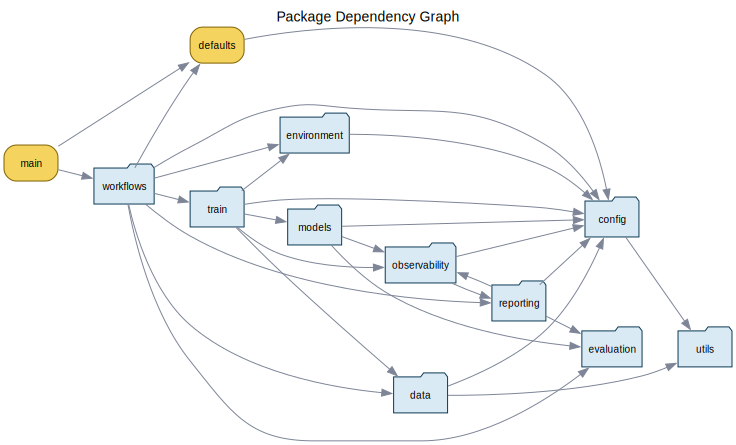

# ENSF617-Probabilistic-Glucose-Forecasting

Living research-style README for the repository. This file is intended to be
the top-level source of truth for the project's problem framing, architecture
story, implementation provenance, current literature inventory, and paper
draft placeholders.

Important status note:
this is not yet a finished paper manuscript. Several sections below are
deliberately written as structured placeholders so the team can keep one
central document updated while experiments, citations, and results continue to
evolve.

Important disclaimer:
this repository is a research codebase for probabilistic glucose forecasting.
It is not a clinically validated decision-support system.

## Quickstart

If you want the shortest path to a successful local run:

1. install dependencies

```bash
pip install -r requirements.txt
```

2. run the tracked tests

```bash
pytest tests -q
```

3. launch a short end-to-end training run

```bash
python main.py --max-epochs 5 --batch-size 32
```

If the run reaches the full workflow path, you should expect artifacts under
`artifacts/main_run/`, including a run summary and, when enabled, checkpoints,
prediction exports, and reports.

## Table Of Contents

- [Quickstart](#quickstart)
- [Current Status](#current-status)
- [Environment Requirements](#environment-requirements)
- [Abstract](#abstract)
- [Reading Guide](#reading-guide)
- [Research Problem](#research-problem)
- [Repository Contributions](#repository-contributions)
- [Current Source Map](#current-source-map)
- [Literature And Provenance Inventory](#literature-and-provenance-inventory)
- [Related Work Placeholder](#related-work-placeholder)
- [Bibliography Placeholder](#bibliography-placeholder)
- [Visual Architecture Guide](#visual-architecture-guide)
- [Dataset And Data Contract](#dataset-and-data-contract)
- [Dataset Access, Governance, And Licensing Placeholder](#dataset-access-governance-and-licensing-placeholder)
- [Model Overview](#model-overview)
- [Training, Evaluation, And Reproducibility](#training-evaluation-and-reproducibility)
- [Experimental Setup Placeholder](#experimental-setup-placeholder)
- [Metrics Placeholder](#metrics-placeholder)
- [Outputs And Artifacts Placeholder](#outputs-and-artifacts-placeholder)
- [Results Placeholder](#results-placeholder)
- [Limitations And Current Constraints](#limitations-and-current-constraints)
- [Fill-In Checklist For The Final Paper Version](#fill-in-checklist-for-the-final-paper-version)
- [Development Workflow Placeholder](#development-workflow-placeholder)
- [How To Cite Placeholder](#how-to-cite-placeholder)
- [License And Reuse](#license-and-reuse)
- [Appendix: Practical Navigation](#appendix-practical-navigation)

## Current Status

What is in good shape today:

- the repository has a runnable end-to-end script and notebook workflow
- the codebase is documented by both hand-authored architecture prose and
  generated dependency graphs
- typed config, runtime profiles, diagnostics, structured evaluation, and
  observability/reporting are all first-class subsystems
- the test suite covers multiple layers beyond just the model itself

What is still in progress:

- the README is a living paper-style scaffold rather than a finalized paper
- the bibliography and related-work sections are not complete yet
- the repo is still AZT1D-oriented rather than fully multi-dataset
- some evaluation/reporting flows still depend on the prediction path after
  fitting

Who this README currently serves best:

- teammates trying to understand the project and extend the codebase
- collaborators turning the repo into a paper-backed research artifact
- new contributors who need one document that connects code, docs, and
  provenance

## Environment Requirements

Current practical requirements:

- Python with the packages listed in [requirements.txt](requirements.txt)
- a working PyTorch installation appropriate for your machine
- optional GPU, MPS, or Slurm environment if you want the corresponding device
  profiles
- Graphviz `dot` if you want to regenerate the static dependency graphs

Notes:

- the repository does not currently pin one exact Python version in the README
- Torch installation may need to be environment-specific, especially for CUDA
  or Apple Silicon
- the dependency-graph generator only needs Graphviz when regenerating graph
  assets, not for normal training/inference workflows

## Abstract

This repository implements a research-oriented probabilistic glucose
forecasting system built around a hybrid Temporal Convolutional Network (TCN)
plus Temporal Fusion Transformer (TFT) architecture. The current codebase is
organized to support multimodal time-series preparation, runtime-aware
training, structured held-out evaluation, and artifact-rich observability.
Rather than acting only as an engineering project, the repository now aims to
carry its own architecture narrative, provenance notes, and literature map.

TODO for final paper version:
- replace this abstract with the final problem statement, dataset description,
  model summary, evaluation protocol, and top-line result numbers
- add explicit forecast horizon, cohort/split definition, and the final claim
  being made
- cite the canonical papers for every major modeling choice

## Reading Guide

Use this README for the high-level research-style overview.

Use these companion documents for deeper detail:

- [docs/current_architecture.md](docs/current_architecture.md)
  Current-system reference for packages, runtime flow, artifact outputs, and
  intended subsystem boundaries.
- [docs/codebase_evolution.md](docs/codebase_evolution.md)
  Historical narrative explaining why the repository evolved into its current
  layered shape.
- [docs/history/](docs/history/)
  Archived milestone notes that document specific refactors in more depth.
- [docs/dependency_graphs/](docs/dependency_graphs/)
  Generated static dependency graphs and machine-readable graph artifacts.
- [docs/assets/](docs/assets/)
  Hand-authored architecture images used to explain the forecasting problem and
  model structure.

## Research Problem

The repository is currently focused on the following research problem:

- forecast future blood glucose values from time-series data
- support uncertainty-aware prediction rather than only point prediction
- combine local temporal pattern extraction with longer-range sequence
  reasoning
- keep enough documentation, evaluation detail, and runtime traceability that
  a run can be interpreted later

The present codebase assumes an AZT1D-style data preparation path and a
grouped batch contract rather than a single raw tensor interface.

TODO for final paper version:
- rewrite this section as a formal problem statement
- clarify prediction target, forecast horizon, population, and intended use
- distinguish clearly between research motivation and validated claim

## Repository Contributions

At the repository level, the current project contributes:

- a fused TCN + TFT forecasting architecture with quantile outputs
- a typed configuration layer for data, model, runtime, and observability
- a Lightning-oriented training wrapper and workflow surface
- a structured evaluation package separate from observability/reporting
- runtime-environment profiles, diagnostics, and backend-tuning helpers
- static dependency graphs that document the current code architecture
- subsystem-aligned tests across config, data, models, training, evaluation,
  observability, environment behavior, and workflows

TODO for final paper version:
- convert this section into paper-style contribution bullets
- separate scientific contributions from software-engineering contributions
- remove any claim that is not supported by experiments or citations

## Current Source Map

This repository already contains substantial internal documentation. The table
below is the best current map from topic to source-of-truth location.

| Topic | Primary source in repo | Role |
| --- | --- | --- |
| Current system architecture | [docs/current_architecture.md](docs/current_architecture.md) | Canonical description of the system as it exists now |
| Repository history and design rationale | [docs/codebase_evolution.md](docs/codebase_evolution.md) | Explains why the current boundaries and layers exist |
| Refactor- and milestone-specific context | [docs/history/](docs/history/) | Detailed notes for data, model, training, evaluation, observability, and runtime refactors |
| Static code architecture evidence | [docs/dependency_graphs/summary.md](docs/dependency_graphs/summary.md) | Import-graph summary and structural evidence |
| Graph generation logic | [scripts/generate_dependency_graphs.py](scripts/generate_dependency_graphs.py) | Reproducible generator for the graph artifacts |
| Model visuals | [docs/assets/FusedModel_architecture.png](docs/assets/FusedModel_architecture.png), [docs/assets/TCN_architecture.png](docs/assets/TCN_architecture.png), [docs/assets/TFT_architecture.PNG](docs/assets/TFT_architecture.PNG) | Visual explanation of the hybrid model |
| Forecasting task visual | [docs/assets/Time_Series.jpg](docs/assets/Time_Series.jpg) | High-level reminder that the problem is sequential forecasting |
| Data contract and feature grouping | [src/data/schema.py](src/data/schema.py) | Shared schema vocabulary and grouped feature semantics |
| Model configuration contract | [src/config/model.py](src/config/model.py) | Typed config for TCN and TFT behavior |
| Runtime defaults and entrypoint policy | [defaults.py](defaults.py), [main.py](main.py) | Baseline experiment setup and user-facing entry surface |

## Literature And Provenance Inventory

This section tracks what literature or external lineage is already explicitly
named inside the repository today.

### Internal Literature Already Present In The Repo

These are internal documents, not external academic references, but they are
already strong project sources:

- [docs/current_architecture.md](docs/current_architecture.md)
- [docs/codebase_evolution.md](docs/codebase_evolution.md)
- [docs/history/data_refactor_summary.md](docs/history/data_refactor_summary.md)
- [docs/history/model_refactor_summary.md](docs/history/model_refactor_summary.md)
- [docs/history/lightning_model_integration_summary.md](docs/history/lightning_model_integration_summary.md)
- [docs/history/train_wrapper_summary.md](docs/history/train_wrapper_summary.md)
- [docs/history/evaluation_package_summary.md](docs/history/evaluation_package_summary.md)
- [docs/history/observability_integration_summary.md](docs/history/observability_integration_summary.md)
- [docs/history/environment_runtime_profiles_summary.md](docs/history/environment_runtime_profiles_summary.md)

### External Sources Already Named In Code Or Docs

These are the external references or implementation lineages that are already
explicitly mentioned somewhere in the repository:

| Source or lineage | Where it is already referenced | Current role |
| --- | --- | --- |
| AZT1D dataset release on Mendeley Data | `src/data/` modules and config comments | Dataset/source provenance |
| PyTorch Lightning DataModule docs | `src/data/` module headers | Guidance for data-layer organization |
| NVIDIA `DeepLearningExamples` | [src/models/tft.py](src/models/tft.py), [src/utils/tft_utils.py](src/utils/tft_utils.py) | TFT implementation lineage |
| `pytorch-tcn` by Paul Krug | [src/models/tcn.py](src/models/tcn.py) | TCN implementation lineage |
| Prior work by SlickMik | `src/data/` module headers | Early pipeline lineage/context |
| Lightning tutorial article | [docs/history/lightning_model_integration_summary.md](docs/history/lightning_model_integration_summary.md) | Guidance for Lightning integration decisions |

### Literature Still Missing From The Repo

These should be added before treating the README as a finished paper-facing
document:

- canonical citation for the original Temporal Fusion Transformer paper
- canonical citation for foundational TCN literature
- citations for glucose forecasting domain papers most relevant to this task
- citations for probabilistic forecasting and quantile-loss methodology
- verified citation for the dataset release if a paper-form citation exists in
  addition to the dataset landing page
- citations for any baseline models used in future comparisons

TODO for final paper version:
- replace this missing-literature list with a proper bibliography
- add a short note for each citation explaining exactly what design choice it
  supports

## Related Work Placeholder

This section should eventually become the paper-style synthesis of the
literature rather than a raw inventory.

Suggested subsection structure:

- glucose forecasting literature
- probabilistic forecasting and uncertainty estimation
- TCN-based medical or physiological sequence models
- TFT and feature-aware temporal forecasting models
- hybrid architectures most similar to this repository

TODO for final paper version:
- summarize what each paper contributes
- explain how this repository differs from or builds on each line of work
- avoid listing references without discussing their relevance

## Bibliography Placeholder

Use this section to hold the verified final citations once the team confirms
the exact sources and formatting.

Suggested entry template:

- `TODO citation`: full verified citation
  Used for: exact design choice, experiment baseline, or dataset provenance

## Visual Architecture Guide

The repository now contains both hand-authored model diagrams and generated
static dependency graphs.

These answer two different questions:

- what the forecasting system is trying to model
- how the current codebase is organized to implement it

### Static Architecture Graphs

The generated dependency graphs are derived from the repository's internal
Python import structure.

[](docs/dependency_graphs/package_graph.svg)

Useful entry points:

- [Package graph](docs/dependency_graphs/package_graph.svg)
- [Production module graph](docs/dependency_graphs/production_module_graph.svg)
- [Entrypoint flow graph](docs/dependency_graphs/entrypoint_flow_graph.svg)
- [Test dependency graph](docs/dependency_graphs/test_dependency_graph.svg)
- [Dependency summary](docs/dependency_graphs/summary.md)
- [Canonical graph JSON](docs/dependency_graphs/dependency_graph.json)

To regenerate the static graph set from the repository root, run:

```bash
python scripts/generate_dependency_graphs.py
```

This requires Python and the Graphviz `dot` executable.

### Model Diagrams

- [Fused model architecture](docs/assets/FusedModel_architecture.png)
- [TCN architecture](docs/assets/TCN_architecture.png)
- [TFT architecture](docs/assets/TFT_architecture.PNG)
- [Time-series forecasting context](docs/assets/Time_Series.jpg)

## Dataset And Data Contract

The current repository is organized around an AZT1D-oriented pipeline.

At a high level, the data path is:

1. download raw dataset material when needed
2. preprocess it into one canonical processed CSV
3. derive semantic feature groups and sequence indices
4. construct grouped batch items for model consumption
5. bind runtime-discovered categorical metadata back into the model config

The data contract is intentionally semantic rather than purely positional. The
system distinguishes static, known, observed, and target features so that the
data layer and model layer can agree on what each feature means.

Current normalization semantics worth knowing:

- raw AZT1D field names are rewritten into canonical columns such as
  `glucose_mg_dl`, `basal_insulin_u`, `bolus_insulin_u`,
  `correction_insulin_u`, `meal_insulin_u`, and `carbs_g`
- `*_insulin_u` columns represent insulin amounts in units, and `carbs_g`
  represents carbohydrate grams
- exact duplicate rows are dropped before later cleanup
- same-subject/same-timestamp collisions are collapsed into one cleaned row so
  sequence indexing can assume one observation per subject and timestamp
- `basal_insulin_u` is treated as a carried state on the shared 5-minute grid
  and is forward/back filled within each subject
- bolus, correction, meal-insulin, and carbohydrate features are treated as
  sparse event quantities and are zero-filled when no event is present
- `device_mode` is normalized to `regular`, `sleep`, `exercise`, or `other`
- `bolus_type` is treated as event-local rather than stateful and is not
  forward-filled across future rows
- the data layer can now produce JSON-ready descriptive statistics for the
  cleaned dataframe and split/window layout

Current config-default semantics worth knowing:

- the public AZT1D download URL and the 5-minute sampling interval are treated
  as dataset-derived defaults
- sequence lengths, split ratios, split mode, and window stride remain
  repository baseline experiment defaults rather than claims from the dataset
  paper

Practical default locations:

- raw downloads: `data/raw/`
- cache and extracted intermediate files: `data/cache/`, `data/extracted/`
- canonical processed dataset: `data/processed/azt1d_processed.csv`

Current practical behavior:

- if the processed CSV is missing, the main workflow can download and prepare
  the public AZT1D source automatically
- the heavier manual verification path lives at
  `tests/manual/manual_data_smoke.py`
- the pipeline is still documented as AZT1D-oriented rather than dataset-agnostic

Best current sources:

- [src/data/schema.py](src/data/schema.py)
- [src/data/datamodule.py](src/data/datamodule.py)
- [src/data/dataset.py](src/data/dataset.py)
- [docs/history/data_refactor_summary.md](docs/history/data_refactor_summary.md)
- [docs/current_architecture.md](docs/current_architecture.md)

TODO for final paper version:
- add a formal dataset subsection with cohort/source details
- specify split policy exactly
- add feature table with units, semantics, and availability timing
- clarify any preprocessing exclusions, leakage protections, and missing-data
  handling

## Dataset Access, Governance, And Licensing Placeholder

Use this section later to describe the practical and ethical status of the
dataset rather than only its tensor/dataflow role.

Suggested fill-in checklist:

- exact dataset name and version used for the reported experiments
- where the dataset comes from and how it is accessed
- whether the workflow downloads it automatically or expects manual setup
- dataset license or terms of use
- any access restrictions, approvals, or rate limits
- privacy, de-identification, or ethics notes relevant to the data source
- local storage expectations and approximate disk footprint

Important instruction for later:
- do not write anything here that has not been verified directly from the
  dataset source or its official documentation
- if dataset terms are uncertain, say so explicitly instead of guessing

## Model Overview

The current forecasting model is a late-fusion hybrid:

- three TCN branches at kernel sizes `3`, `5`, and `7`
- one TFT branch over grouped static, historical, and future-known inputs
- one post-branch GRN fusion layer
- one final head that emits quantile forecasts

The current implementation treats quantile prediction as part of the model
contract rather than leaving loss interpretation to outer training code.

Best current sources:

- [src/models/fused_model.py](src/models/fused_model.py)
- [src/models/tcn.py](src/models/tcn.py)
- [src/models/tft.py](src/models/tft.py)
- [src/models/grn.py](src/models/grn.py)
- [src/models/nn_head.py](src/models/nn_head.py)
- [docs/history/model_refactor_summary.md](docs/history/model_refactor_summary.md)
- [docs/current_architecture.md](docs/current_architecture.md)

TODO for final paper version:
- add a formal method section with notation
- include exact input/output tensor descriptions
- state the loss function mathematically
- clarify which architectural components are inherited, adapted, or novel
- add citations for every major modeling block

## Training, Evaluation, And Reproducibility

The repository exposes both script and notebook entry surfaces:

- [main.py](main.py)
- [main.ipynb](main.ipynb)
- [defaults.py](defaults.py)

The entrypoint path is intentionally thin and delegates reusable orchestration
to `src/workflows/`, `src/train.py`, `src/environment/`, and the config layer.

### Install Dependencies

Local:

```bash
pip install -r requirements.txt
```

Apple Silicon often benefits from installing PyTorch separately first:

```bash
pip install torch
pip install -r requirements.txt
```

`torchvision` and `torchaudio` are not required by this repository directly.
If you choose to install them, make sure they match the exact PyTorch build in
your active environment; mismatched `torch` / `torchvision` versions can fail
during import before the project code runs.

### Run Tests

Run the full tracked test suite:

```bash
pytest tests -q
```

Run a few representative subsystems:

```bash
pytest tests/config tests/training tests/workflows/test_training_workflow.py -q
```

Run evaluation-focused tests:

```bash
pytest tests/evaluation -q
```

### Manual Data Smoke Test

```bash
python tests/manual/manual_data_smoke.py
```

This is intentionally separate from the normal pytest suite because it may
touch the network and real filesystem state.

### Run The Pipeline

Minimal example:

```bash
python main.py --max-epochs 5 --batch-size 32
```

Runtime-profile examples:

```bash
python main.py --device-profile local-cpu
python main.py --device-profile local-cuda
python main.py --device-profile apple-silicon
python main.py --device-profile slurm-cpu
python main.py --device-profile slurm-cuda
python main.py --device-profile colab-cpu
python main.py --device-profile colab-cuda
```

Diagnostics-only run:

```bash
python main.py --device-profile auto --run-diagnostics-only
```

Short benchmark-style run:

```bash
python main.py --device-profile auto --run-benchmark-only --benchmark-train-batches 10
```

### Expected Outputs

Depending on the run mode and observability settings, the workflow can produce:

- `run_summary.json`
- checkpoint files under the configured checkpoint directory
- `test_predictions.pt`
- `test_predictions.csv`
- Plotly HTML reports
- `benchmark_summary.json` for benchmark-only runs

The default top-level output directory is `artifacts/main_run/`.

### Reproducibility Notes

What the current codebase already supports:

- shared defaults for script and notebook paths
- typed config serialization
- runtime-environment detection and device profiles
- structured held-out evaluation helpers
- artifact output directories for reports, predictions, and checkpoints
- generated static architecture graphs

TODO for final paper version:
- document exact experiment seeds
- document full hyperparameter table
- document hardware/software environment for headline runs
- add a clean experiment registry or results table linked to artifacts

## Experimental Setup Placeholder

Use this section later for the paper-style experiment protocol.

Suggested subsection structure:

- train/validation/test split definition
- forecast horizon and sampling interval
- hardware used for the headline runs
- training duration, epoch count, and early-stopping policy
- optimizer, learning-rate, batch-size, and precision settings
- checkpoint-selection policy
- ablations or baseline-comparison protocol

Instruction for later:
- keep this section factual and reproducible
- distinguish clearly between defaults in the codebase and the exact settings
  used for a reported experiment

## Metrics Placeholder

Use this section later to define the evaluation metrics before inserting any
tables.

Suggested fill-in checklist:

- primary point-forecast metrics
- primary probabilistic or quantile-quality metrics
- which metric selects the best checkpoint
- which metrics are reported only on held-out test data
- any per-horizon, per-subject, or grouped metrics
- any calibration, sharpness, or uncertainty-specific measures

Instruction for later:
- define every metric in words before showing result numbers
- state clearly whether lower or higher is better
- avoid mixing validation-selection metrics with final test-report metrics

## Outputs And Artifacts Placeholder

Use this section later to show what a successful run produces on disk and how
those files should be interpreted.

Suggested fill-in checklist:

- example artifact directory tree
- what `run_summary.json` contains
- when `test_predictions.pt` is produced
- when `test_predictions.csv` is produced
- when Plotly HTML reports are produced
- where checkpoints are stored
- when `benchmark_summary.json` appears

Suggested future snippet:

```text
artifacts/main_run/
  TODO: add real example tree from a representative run
```

Instruction for later:
- use one real successful run as the example
- keep filenames and paths aligned with the actual current workflow rather than
  a hypothetical layout

## Results Placeholder

No finalized benchmark table is claimed in this README yet.

Suggested structure for future insertion:

| Experiment | Split definition | Horizon | Main metrics | Uncertainty metrics | Artifact path | Notes |
| --- | --- | --- | --- | --- | --- | --- |
| TODO baseline | TODO | TODO | TODO | TODO | TODO | TODO |
| TODO fused model | TODO | TODO | TODO | TODO | TODO | TODO |

TODO for final paper version:
- add exact metrics used for comparison
- separate validation selection metrics from held-out reporting metrics
- report both point and probabilistic quality where relevant
- link each row to reproducible artifact outputs

## Limitations And Current Constraints

The current repository intentionally still carries several constraints:

- the data path is AZT1D-oriented rather than fully multi-dataset
- some feature-spec behavior still includes transitional fallback logic
- detailed evaluation currently depends on the prediction path
- some observability features are optional and environment-dependent
- the literature inventory is incomplete and not yet a finished bibliography
- the README currently contains structured placeholders where final paper
  content has not yet been written

These are not hidden issues; they are part of the current documented state of
the project.

## Fill-In Checklist For The Final Paper Version

Before treating this README as the final paper-facing overview, fill in:

- the final abstract with actual results
- the exact research question and claim
- the canonical citations for TFT, TCN, quantile forecasting, and glucose
  forecasting literature
- the formal dataset description and split protocol
- the exact hyperparameter table
- the final experiment and baseline comparison table
- the limitations/validity section in paper language
- the bibliography section with verified citation formatting

## Development Workflow Placeholder

Use this section later for contributor-facing repo-maintenance guidance.

Suggested fill-in checklist:

- how to run the main test suite
- how to run a focused subsystem test file
- how to regenerate dependency graphs
- where to add new architecture/history docs
- how to update README-facing figures or assets
- any formatting, linting, or type-checking commands the team wants to
  standardize

Instruction for later:
- keep this section short and operational
- link to deeper docs instead of duplicating long contributor instructions

## How To Cite Placeholder

Use this section later once the team decides the preferred project citation.

Suggested fill-in checklist:

- repository citation text
- paper citation text, if a paper/preprint exists
- version, commit, or release guidance for reproducibility

Instruction for later:
- do not invent a citation format before the team agrees on one

## License And Reuse

The repository includes a license file at [LICENSE](LICENSE).

Placeholder for later:

- add one short sentence summarizing the intended reuse expectations for code
- if needed, separately clarify dataset reuse expectations, since dataset terms
  may differ from repository code licensing

## Appendix: Practical Navigation

If you are trying to navigate the codebase quickly, start here:

- data pipeline: `src/data/`
- model architecture: `src/models/`
- training wrapper: `src/train.py`
- workflow and CLI orchestration: `src/workflows/`
- runtime profiles and diagnostics: `src/environment/`
- evaluation: `src/evaluation/`
- observability and reporting: `src/observability/`

If you want the shortest recommended reading order:

1. this README
2. [docs/current_architecture.md](docs/current_architecture.md)
3. [docs/codebase_evolution.md](docs/codebase_evolution.md)
4. the most relevant document under [docs/history/](docs/history/)
