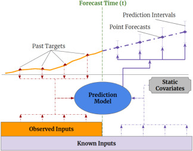
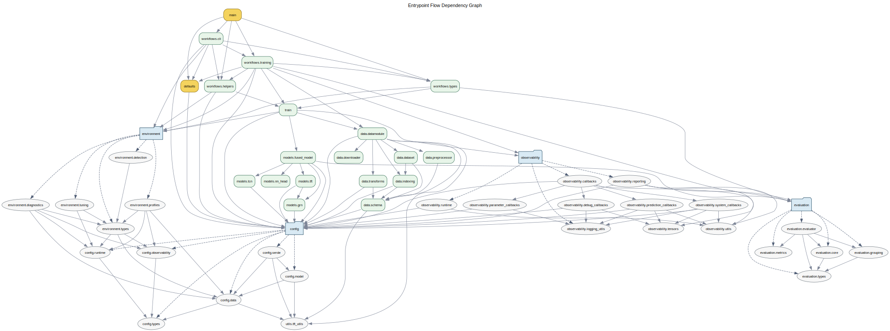
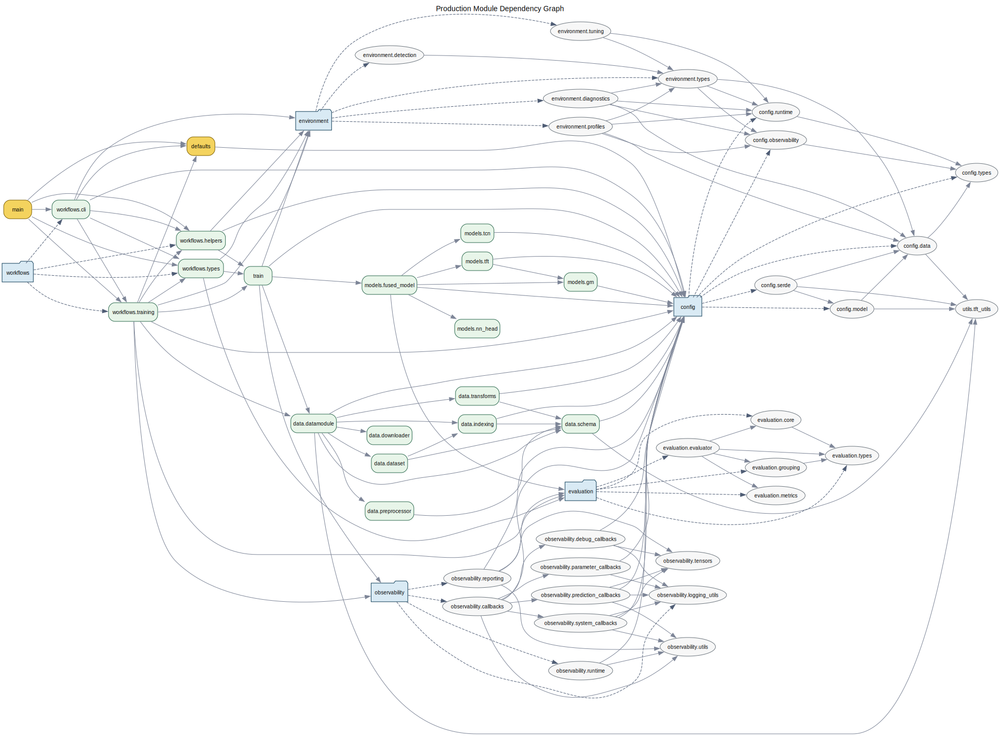
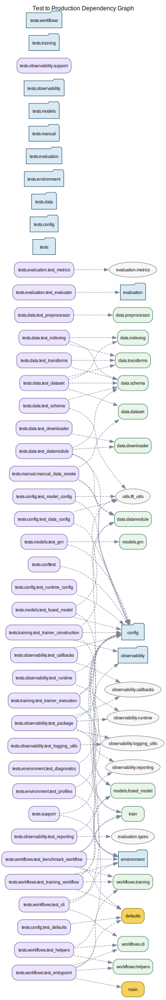

# Current Architecture

This document describes the repository as it exists today: the major packages,
their ownership boundaries, the runtime flow, the artifact outputs, and the
constraints that are still intentional.

Use this file as the current-system reference. For how the repository reached
this shape, read [`codebase_evolution.md`](codebase_evolution.md).

## System Goal

The repository is a research-oriented probabilistic glucose forecasting system
built around a fused TCN + TFT architecture, a Lightning-oriented training
runtime, structured held-out evaluation, a dedicated post-run reporting layer,
and a richer observability surface for inspection and debugging.

At a high level, the system is trying to do five things well:

- prepare AZT1D data into a stable model-facing contract
- train a probabilistic hybrid forecasting model with clear runtime ownership
- compute structured held-out evaluation rather than only scalar test metrics
- package post-run results into one canonical shared-report surface
- leave behind enough logs and artifacts that a run can be understood later

## Repository Map

A simplified view of the repository today looks like this:

```text
defaults.py
main.py
main.ipynb
scripts/
  generate_dependency_graphs.py
docs/
  assets/
  dependency_graphs/
  history/
  codebase_evolution.md
  current_architecture.md
src/
  config/
  data/
  environment/
  evaluation/
  models/
  observability/
  reporting/
  workflows/
  train.py
  utils/
tests/
  config/
  data/
  environment/
  evaluation/
  manual/
  models/
  observability/
  reporting/
  training/
  workflows/
```

Each of those areas exists for a specific reason.

## Visual Guide To The Repository

This document includes both the hand-authored model diagrams stored under
`docs/assets/` and the generated static dependency graphs under
`docs/dependency_graphs/`. Together they answer two different questions:

- what the forecasting system is trying to model and predict
- how the current codebase is organized to implement that system

Interpret the dependency diagrams as static import relationships rather than a
full runtime call trace. They are intended to reinforce the architecture
sections below, not replace them.

These generated artifacts are refreshed from the repository root with:

```bash
python scripts/generate_dependency_graphs.py
```

### Problem Context: The Time-Series Forecasting Setting



What this is:
an external-facing visual reminder that this repository is solving a
time-series forecasting problem rather than a one-shot tabular prediction task.

What it is doing:
it frames the forecasting problem as a sequence of historical observations used
to predict future values over a horizon.

Why it matters:
many later architecture choices only make sense in a sequential setting, such
as encoder and decoder windows, temporal feature grouping, causal convolutions,
and horizon-aligned quantile outputs.

How to use it while reading the code:
keep this mental model in mind when reading `src/data/`, `src/models/tcn.py`,
`src/models/tft.py`, and the evaluation and reporting packages, because those
areas are built around sequence structure rather than isolated rows.

### High-Level Package Boundaries: What Major Areas Exist

[](dependency_graphs/package_graph.svg)

What this is:
the top-level package dependency map for the repository's internal Python code.

What it is doing:
it shows how the stable entry surfaces (`main`, `defaults`) connect to the main
subsystems (`config`, `data`, `environment`, `evaluation`, `models`,
`observability`, `reporting`, `workflows`, and `train`).

Why it matters:
this is the fastest way to understand the current architectural boundary lines
without reading every module in detail.

Purpose:
use this graph for onboarding, scoping refactors, and checking whether new
imports are preserving the intended subsystem split.

### Entrypoint-To-Orchestration Flow: How A Run Starts

[](dependency_graphs/entrypoint_flow_graph.svg)

What this is:
the static dependency view centered on the user-facing entry surfaces.

What it is doing:
it shows how `main.py` and `defaults.py` reach into the workflow, config,
training, environment, reporting, and runtime-observability layers.

Why it matters:
the repository deliberately keeps the root entrypoints thin, so this diagram
helps clarify that the heavy orchestration lives below them rather than inside
the root files themselves.

Purpose:
use this view when you want to understand where CLI behavior ends and reusable
workflow logic begins.

### Full Production Module Map: How The Internal Codebase Connects

[](dependency_graphs/production_module_graph.svg)

What this is:
the complete static module-level dependency graph for production code.

What it is doing:
it shows import relationships between `main.py`, `defaults.py`, and all Python
modules under `src/`.

Why it matters:
this is the most detailed static picture of how the current implementation is
wired together, including architectural hubs such as `workflows.training`,
`data.datamodule`, `train`, `models.fused_model`, and the newer
`reporting` package.

Purpose:
use this graph for impact analysis, refactor planning, and identifying highly
connected modules that deserve extra care.

### Test Coverage Shape: Which Production Areas Tests Touch

[](dependency_graphs/test_dependency_graph.svg)

What this is:
the test-to-production dependency view.

What it is doing:
it shows which production modules are imported by the current test suite.

Why it matters:
tests are intentionally split out from the main architecture graph so they do
not drown the production structure, but they still matter when judging how
well each subsystem is exercised.

Purpose:
use this graph when planning refactors or identifying parts of the repository
that may need broader test coverage.

### Hybrid Forecasting Model Overview: How The Main Model Fits Together

[](assets/FusedModel_architecture.png)

What this is:
the high-level architecture diagram for the repository's main forecasting
model, `FusedModel`.

What it is doing:
it shows how the repository combines multiple temporal processing branches into
one forecasting pipeline rather than relying on a single sequence model.

Why it matters:
this diagram explains the repo's central modeling choice: combine a
convolution-oriented temporal path with a transformer-oriented temporal path,
then fuse their learned representations before producing quantile forecasts.

Purpose:
use this image first when reading `src/models/fused_model.py`, because it gives
the conceptual skeleton for the code-level forward pass.

### Temporal Convolution Branch: What The TCN Path Contributes

[](assets/TCN_architecture.png)

What this is:
the architecture view for the temporal convolution branch used inside the fused
model.

What it is doing:
it emphasizes causal convolution, residual processing, and local
pattern extraction over the historical window.

Why it matters:
the TCN branch is the part of the model that is especially good at capturing
shorter-range local temporal structure and multi-scale history patterns.

Purpose:
use this diagram when reading `src/models/tcn.py` and the TCN-related sections
of `src/models/fused_model.py` so the code maps back to the intended temporal
feature extractor.

### Temporal Fusion Transformer Branch: What The TFT Path Contributes

[](assets/TFT_architecture.PNG)

What this is:
the architecture view for the Temporal Fusion Transformer branch.

What it is doing:
it highlights the richer feature-group-aware path that combines static inputs,
historical inputs, and future-known inputs through the TFT-style processing
stack.

Why it matters:
the TFT branch is the part of the model designed to capture longer-range
context, feature-role distinctions, and horizon-aware sequence reasoning.

Purpose:
use this diagram when reading `src/models/tft.py`, `src/data/schema.py`, and
runtime-bound feature metadata code, because that path depends heavily on
semantic feature grouping.

### Graph Artifact Index

For convenience, the full static artifact set is linked here as well:

- [Package graph](dependency_graphs/package_graph.svg)
- [Production module graph](dependency_graphs/production_module_graph.svg)
- [Entrypoint flow graph](dependency_graphs/entrypoint_flow_graph.svg)
- [Test dependency graph](dependency_graphs/test_dependency_graph.svg)
- [Dependency summary](dependency_graphs/summary.md)
- [Canonical graph JSON](dependency_graphs/dependency_graph.json)

## Repository Map By Responsibility

For day-to-day navigation, the most useful way to think about the repository is
by task rather than by alphabetical file listing.

### If you are working on data ingestion or dataset semantics

Look at:

- `src/config/data.py`
- `src/data/downloader.py`
- `src/data/preprocessor.py`
- `src/data/schema.py`
- `src/data/transforms.py`
- `src/data/indexing.py`
- `src/data/dataset.py`
- `src/data/datamodule.py`
- `tests/data/`

### If you are working on model architecture or forecast behavior

Look at:

- `src/config/model.py`
- `src/models/fused_model.py`
- `src/models/tcn.py`
- `src/models/tft.py`
- `src/models/grn.py`
- `src/models/nn_head.py`
- `tests/models/test_fused_model.py`
- `tests/models/test_grn.py`

### If you are working on run orchestration or checkpoint behavior

Look at:

- `defaults.py`
- `main.py`
- `src/workflows/`
- `src/environment/`
- `src/config/runtime.py`
- `src/train.py`
- `tests/workflows/`
- `tests/training/`

### If you are working on environment detection, device profiles, or
preflight diagnostics

Look at:

- `src/environment/detection.py`
- `src/environment/profiles.py`
- `src/environment/diagnostics.py`
- `src/environment/tuning.py`
- `main.py`
- `main.ipynb`
- `tests/config/`
- `tests/workflows/`

### If you are working on live observability during training or evaluation

Look at:

- `src/config/observability.py`
- `src/observability/runtime.py`
- `src/observability/callbacks.py`
- `src/observability/debug_callbacks.py`
- `src/observability/system_callbacks.py`
- `src/observability/parameter_callbacks.py`
- `src/observability/prediction_callbacks.py`
- `tests/observability/`

### If you are working on post-run reporting, exports, or report sinks

Look at:

- `src/reporting/types.py`
- `src/reporting/builders.py`
- `src/reporting/prediction_rows.py`
- `src/reporting/report_tables.py`
- `src/reporting/report_text.py`
- `src/reporting/exports.py`
- `src/reporting/structured_exports.py`
- `src/reporting/tensorboard.py`
- `src/reporting/plotly_reports.py`
- `tests/reporting/`

### If you are working on canonical metric computation

Look at:

- `src/evaluation/core.py`
- `src/evaluation/metrics.py`
- `src/evaluation/grouping.py`
- `src/evaluation/evaluator.py`
- `tests/evaluation/`

## Architectural Principles

The current architecture is built around a few stable principles:

- semantic data contracts are preferred over raw positional tensors
- model behavior, data lifecycle, runtime orchestration, evaluation,
  observability, and reporting are separate concerns
- runtime policy is expressed through typed config objects plus an explicit
  environment-aware resolution layer
- root-level entrypoints should stay thin and user-facing
- evaluation computes metric truth once, then reporting packages and renders it
- post-run sinks should consume canonical shared-report surfaces rather than
  quietly rebuilding their own metric logic
- documentation should explain intent and boundaries, not only APIs

The generated dependency graphs are a lightweight way to validate whether the
current import structure still reflects those intended boundaries.

## End-To-End Runtime Flow

The normal run path through the repository is:

1. `defaults.py` builds baseline config objects for data, model, training,
   snapshots, and observability.
2. `main.py` or `main.ipynb` parses user-supplied overrides and converts them
   into typed config objects plus entry-surface runtime options.
   Under the hood, the heavier orchestration lives in `src/workflows/`, while
   `main.py` remains the stable user-facing facade.
3. `src/environment/` detects the current runtime context and resolves the
   requested device profile into effective runtime defaults.
4. `src/environment/diagnostics.py` runs preflight validation so likely
   backend or dependency issues can fail early and be summarized cleanly.
5. `src/environment/tuning.py` applies environment-variable overrides and
   backend-level runtime knobs such as TF32, thread counts, benchmark boundary
   device synchronization, and optional model compilation.
6. `src/workflows/training.py` constructs `AZT1DDataModule` from `config.data`.
7. `src/workflows/training.py` constructs `FusedModelTrainer` from the
   top-level config plus runtime policy configs.
8. `FusedModelTrainer` calls `datamodule.prepare_data()` and `datamodule.setup()`
   before model construction.
9. `AZT1DDataModule` discovers runtime categorical cardinalities and final
   sequence-aligned feature details, then binds them into a new runtime config.
10. `FusedModelTrainer` builds `FusedModel` from that runtime-bound config.
11. `FusedModelTrainer` assembles callbacks, loggers, checkpoint policy, and the
    Lightning `Trainer`.
12. Lightning executes `fit(...)`.
13. If test windows exist, the wrapper can run `test(...)` and `predict(...)`
    against the resolved checkpoint or the current in-memory weights.
14. `src/workflows/training.py` uses raw predictions plus aligned test batches
    to compute structured held-out evaluation through `src/evaluation/`.
15. `src/reporting/builders.py` packages raw predictions and grouped evaluation
    into one canonical `SharedReport`.
16. `src/workflows/training.py` can also ask the DataModule for a best-effort
    dataset summary and export that summary as `data_summary.json`.
17. `src/reporting/tensorboard.py` can mirror the shared report into
    TensorBoard-compatible logger backends as a post-run dashboard sink.
18. `src/reporting/exports.py`,
    `src/reporting/structured_exports.py`, and
    `src/reporting/plotly_reports.py`
    can write CSV, JSON, and HTML report artifacts from the same post-run
    surfaces.
19. `src/workflows/training.py` writes a compact `run_summary.json`
    describing the run, including resolved runtime-environment metadata.

That same underlying workflow is shared by the notebook path. `main.ipynb`
reuses the same Python surfaces rather than keeping its own independent
training logic.

The [entrypoint flow graph](dependency_graphs/entrypoint_flow_graph.svg)
provides a static visual companion to this runtime path by showing how the
top-level entry surfaces reach the orchestration layers below them.

## Data Flow

The most important end-to-end data flow in the repository is:

1. raw AZT1D archive is downloaded and extracted by `src/data/downloader.py`
2. the raw export is standardized into one canonical processed CSV by
   `src/data/preprocessor.py`
3. the cleaned dataframe is loaded and normalized by
   `src/data/transforms.py`
4. semantic feature groups are derived through `src/data/schema.py`
5. split frames and legal sequence windows are built through
   `src/data/indexing.py`
6. `src/data/dataset.py` turns each index entry into one structured sample
7. `AZT1DDataModule` wraps those datasets in train/validation/test dataloaders
8. batches flow into `FusedModel` through the grouped batch contract
9. predictions and aligned test batches later flow into `src/evaluation/`
10. grouped evaluation plus row-level prediction outputs flow into
    `src/reporting/`

The important architectural point is that the data is progressively made more
structured as it moves through the system. The repo does not jump directly from
downloaded files to model tensors in one opaque step.

Current normalization details that matter operationally:

- raw vendor names are rewritten to canonical modeling columns with explicit
  unit-bearing names such as `glucose_mg_dl`, `basal_insulin_u`,
  `bolus_insulin_u`, `correction_insulin_u`, `meal_insulin_u`, and `carbs_g`
- exact duplicate rows are dropped before timestamp-level cleanup
- same-subject/same-timestamp collisions are reduced to one representative row
  before sequence indexing
- `basal_insulin_u` is treated as a carried rate on the shared 5-minute grid
  rather than as a sparse event signal
- bolus, correction, meal-insulin, and carbohydrate quantities are treated as
  sparse event variables and zero-filled when absent
- `device_mode` is normalized to the paper-aligned vocabulary
  `regular` / `sleep` / `exercise` / `other`
- `bolus_type` is treated as event-local and is intentionally not forward-filled

## Config Flow

The repository has two important config states:

- declarative config
- runtime-bound config

### Declarative config

This is the config created by `defaults.py`, the CLI, tests, or notebook code.
It expresses the intended run setup:

- dataset paths and sequence lengths
- model hyperparameters
- Trainer policy
- snapshot policy
- observability policy

For the AZT1D data defaults specifically, the code treats only the public
dataset location and the 5-minute sampling cadence as dataset-derived
assumptions. Sequence lengths, split ratios, split mode, and window stride are
kept as repository baseline experiment policy.

### Runtime-bound config

This is the config produced after the DataModule has prepared and inspected the
actual dataset. It includes the declarative settings plus runtime-discovered
details such as:

- categorical cardinalities
- fallback feature specs when needed
- finalized TFT-facing sequence-aligned metadata

The handoff happens in `AZT1DDataModule.bind_model_config(...)`.

### Why this distinction matters

This distinction explains several otherwise unusual design choices:

- why the trainer wrapper prepares the DataModule before constructing the model
- why config serialization matters for checkpoints
- why the repo cannot treat the initial config as the complete final truth for
  model construction

## Root-Level Entry Surfaces

### `defaults.py`

`defaults.py` is the baseline configuration surface for script and notebook
usage.

It provides builders for:

- the top-level model/data config
- `TrainConfig`
- `SnapshotConfig`
- `ObservabilityConfig`

It also bootstraps `src/` imports for root-level consumers. That means root
entrypoints and notebooks can use imports like `from data...` and `from config...`
without duplicating path setup logic in multiple places.

The defaults are intentionally convenience-oriented research defaults. They are
meant to make the repo runnable end to end, not to encode one final or optimal
experiment configuration.

### `main.py`

`main.py` is the primary script entrypoint and the stable top-level user-facing
facade.

Its role is deliberately narrow:

- parse CLI arguments
- normalize them into typed config
- delegate CLI assembly and workflow execution to `src/workflows/`
- preserve a convenient public import surface for scripts, notebooks, and
  tests

It is intentionally not the place where:

- data preprocessing logic lives
- model internals live
- evaluation metrics are defined
- callback implementations are written
- post-run reporting sinks are implemented
- the heavier train/evaluate/predict orchestration lives

That separation is what keeps the script readable even as the rest of the
system grows.

The entry surface still coordinates the runtime-environment layer conceptually
by exposing helpers that cover:

- selecting or inferring a device profile
- applying explicit runtime overrides
- running preflight diagnostics before training
- recording environment metadata in `run_summary.json`

In implementation terms, that responsibility is split across:

- `src/workflows/cli.py`
  argument parsing, CLI config assembly, and terminal-oriented output
- `src/workflows/training.py`
  reusable train/evaluate/predict and benchmark workflows
- `src/workflows/helpers.py`
  small parsing, normalization, and workflow-support helpers
- `src/workflows/types.py`
  stable workflow artifact dataclasses

The benchmark-only workflow also lives in `src/workflows/training.py`. It
focuses on environment comparison rather than full held-out evaluation while
preserving the same runtime resolution and tuning path.
It also owns the CUDA synchronization boundaries used to keep benchmark timing
closer to completed device work rather than queued asynchronous kernels.

### `main.ipynb`

The notebook is a convenience surface for interactive work, not a second
architecture. It exists so teammates can explore or debug runs interactively
without having to fork the actual pipeline into notebook-only logic.

It mirrors the same environment-aware workflow as `main.py`, including
profile resolution and preflight diagnostics, while exposing those controls as
editable notebook variables instead of CLI flags.

## Configuration Layer: `src/config/`

The config package is the canonical source of runtime contracts.

### Main modules

- `data.py`
  data locations, split policy, sequence lengths, loader settings, and feature
  grouping inputs
- `model.py`
  `TCNConfig`, `TFTConfig`, and the top-level `Config`
- `runtime.py`
  `TrainConfig` and `SnapshotConfig`
- `observability.py`
  `ObservabilityConfig`
- `serde.py`
  conversion helpers between typed config objects and plain checkpoint-friendly
  dictionaries
- `types.py`
  shared type aliases such as path-like inputs
- `__init__.py`
  public facade for convenient imports

### Why this package matters

Config is not a peripheral utility in this repository. It defines:

- the data contract
- the model's structural parameters
- Trainer behavior
- checkpointing policy
- observability policy
- checkpoint serialization behavior

The move into `src/config/` reflects the fact that these are central project
contracts, not miscellaneous helpers.

### The Most Important Config Objects

When reading or modifying the repo, the main config classes to know are:

- `DataConfig`
  dataset access, sequence construction, split policy, loader behavior
- `TCNConfig`
  project-specific TCN branch settings
- `TFTConfig`
  TFT branch settings plus runtime-bound feature/count metadata
- `Config`
  top-level data + model config bundle
- `TrainConfig`
  Lightning `Trainer` behavior
- `SnapshotConfig`
  checkpoint policy
- `ObservabilityConfig`
  logging, telemetry, and reporting policy

## Environment Layer: `src/environment/`

The environment package is the runtime interpretation layer that sits between
entry-surface user intent and the lower-level training stack.

For the milestone that introduced this layer, see
[`history/environment_runtime_profiles_summary.md`](history/environment_runtime_profiles_summary.md).

### Main modules

- `types.py`
  shared runtime-environment dataclasses and device-profile constants
- `detection.py`
  backend, platform, notebook, and cluster detection
- `profiles.py`
  high-level device-profile inference and profile-to-runtime-default
  resolution
- `diagnostics.py`
  preflight validation, diagnostic formatting, and best-effort runtime failure
  analysis
- `tuning.py`
  low-level backend tuning and optional model compilation helpers
- `__init__.py`
  convenience facade for the public environment API

### Why this package exists

This code used to live closer to the config layer, but it grew beyond pure
config shaping.

The environment layer now owns:

- runtime-environment detection
- high-level profile selection such as local, Colab, Slurm, or Apple Silicon
- profile default resolution
- compatibility and preflight checks
- environment-sensitive failure explanation
- backend-level tuning actions that sit below profile selection

This keeps `src/config/` focused on typed contracts while still keeping
environment-aware runtime logic explicit and reusable.

### Runtime tuning follow-up

The environment layer also contains a narrower "last-mile tuning" step.

That step exists because profile selection alone is not enough. Once a profile
chooses a policy, something still has to apply:

- MPS allocator/fallback environment variables
- float32 matmul precision
- CUDA TF32 and cuDNN benchmark settings
- Torch thread-count tuning
- optional `torch.compile(...)`

This keeps backend knobs centralized rather than sprinkling Torch-specific
setters across `main.py` and `src/train.py`.

The current acceleration philosophy is:

- model code stays eager by default
- runtime policy can opt into `torch.compile(...)`
- benchmark-only synchronization lives at workflow/runtime boundaries
- deprecated TorchScript-specific optimization paths are no longer the primary
  performance mechanism

### Current profile philosophy

The repository now supports both:

- high-level device profiles such as `auto`, `colab-cuda`, and
  `apple-silicon`
- lower-level explicit overrides such as accelerator, precision, worker, and
  progress-bar settings

The precedence rule is intentionally simple:

- explicit user override wins
- otherwise profile default applies
- otherwise repository baseline default applies

That rule is what makes `auto` useful without making explicit reproducible
workflows harder.

## Data Layer: `src/data/`

The data pipeline is organized around `AZT1DDataModule`.

### Responsibility split

- `downloader.py`
  download and extract the raw AZT1D archive
- `preprocessor.py`
  build one canonical processed CSV from the raw dataset
- `schema.py`
  define feature groups, category vocabularies, and model-facing schema rules
- `transforms.py`
  load and normalize the processed dataframe, resolve duplicate-timestamp
  collisions, and apply missing-data policy by feature semantics
- `indexing.py`
  build legal encoder/decoder windows and split-specific sample indices
- `dataset.py`
  materialize one structured sample per index entry
- `datamodule.py`
  own the Lightning lifecycle and DataLoader creation

### Data lifecycle

The important lifecycle split is:

- `prepare_data()`
  disk-side effects such as download/extraction/preprocessing
- `setup()`
  in-memory dataframe loading, category-map fitting, split creation, and
  dataset construction
- loader methods
  batching only

That split is intentional because the repo leans on Lightning conventions
without giving up control over its runtime-bound model setup.

### Model-Facing Batch Contract

The current batch contract is explicit:

```python
{
    "static_categorical": ...,
    "static_continuous": ...,
    "encoder_continuous": ...,
    "encoder_categorical": ...,
    "decoder_known_continuous": ...,
    "decoder_known_categorical": ...,
    "target": ...,
    "metadata": ...,
}
```

That grouped layout matters because the model does not treat all inputs as one
anonymous tensor. The groups correspond to real semantic roles in the fused
architecture.

### Runtime Metadata Binding

One of the most important current contracts is that the DataModule owns
data-derived runtime metadata.

After `setup()`, it can provide:

- categorical embedding cardinalities in TFT order
- fallback feature specs when explicit feature specs are absent
- sequence lengths aligned with the actual prepared dataset
- descriptive statistics for the cleaned dataframe and split/window layout

`bind_model_config(...)` returns a new config rather than mutating the original
in place. That is an intentional design choice:

- the declarative config remains inspectable
- the runtime-bound config becomes explicit
- training code can log or compare both if needed

This contract is why the training wrapper prepares the DataModule before
constructing the model.

### Data-Layer Extension Rule

If you are changing feature semantics, split policy, preprocessing behavior, or
sample structure, the data layer is the first place to update. Do not patch
those concerns ad hoc in `main.py` or inside `FusedModel`.

## Model Layer: `src/models/`

The model package contains the forecasting architecture.

### Main files

- `fused_model.py`
  top-level Lightning-native forecasting model
- `tft.py`
  Temporal Fusion Transformer branch
- `tcn.py`
  project-specific causal residual TCN branch
- `grn.py`
  gated residual network blocks
- `nn_head.py`
  final prediction head

### Fused Forecasting Design

The current model is a late-fusion hybrid:

- three TCN branches at kernel sizes `3`, `5`, and `7`
- one TFT branch over grouped static, historical, and future-known inputs
- one post-branch GRN fusion layer
- one final head that emits quantile forecasts

The forward logic is conceptually:

1. split `encoder_continuous` into known-history, observed-history, and target
   history slices
2. build narrower history-only inputs for the TCN branches
3. build grouped TFT inputs from static features, encoder history, and
   decoder-known future features
4. run the TCN branches to get horizon-aligned latent features
5. run the TFT branch to get horizon-aligned decoder features before final
   quantile projection
6. concatenate those latent features
7. fuse them with a GRN
8. project them through `NNHead` into final quantile outputs

This means the fusion happens in representation space, not after each branch
has already collapsed to its own final forecast.

### Probabilistic Output Contract

`FusedModel` predicts quantiles and owns the quantile-loss interpretation of
those channels. It does not leave that semantic contract to outer training
code.

The model also owns:

- `training_step(...)`
- `validation_step(...)`
- `test_step(...)`
- `predict_step(...)`
- `configure_optimizers(...)`

That boundary keeps output semantics and supervision behavior close together.

### Lightning-Specific Model Decisions

The current model contains a few architectural decisions that exist because the
repo is Lightning-oriented:

- config can be passed either as a typed `Config` or as a serialized mapping so
  `load_from_checkpoint(...)` works cleanly
- lazy TFT parameters are proactively materialized during model construction so
  optimizer setup is deterministic
- quantiles are cached on the model so output width, pinball loss, and point
  forecast extraction all use the same ordered tuple

### Model-Layer Extension Rule

If you change forecast semantics, branch composition, fusion behavior, or loss
interpretation, that change should be reflected in:

- `src/models/fused_model.py`
- the relevant branch module
- config contracts in `src/config/model.py`
- the corresponding tests

Try not to smuggle model semantics into the training wrapper or reporting code.

## Training Runtime Layer: `src/train.py`

`src/train.py` is the orchestration layer above the model and data stack.

Its main public surface is `FusedModelTrainer`.

### What it owns

- preparing and setting up the DataModule before model construction
- binding runtime config through the DataModule
- constructing `FusedModel`
- assembling callbacks
- assembling the Lightning `Trainer`
- fit/test/predict orchestration
- caching the best-checkpoint path and the current in-memory runtime state

### What it intentionally does not own

- data preprocessing internals
- model forward math
- metric definitions
- post-run report building
- report sink rendering

### Callback and checkpoint policy

The wrapper uses validation presence to decide how to build checkpoints:

- with validation data, snapshots can be ranked on `val_loss`
- without validation data, it falls back to a last-checkpoint-only policy

This is an important detail because the repo does not pretend a meaningful
`"best"` checkpoint exists when no validation signal exists to rank snapshots.

## Workflow Layer: `src/workflows/`

The workflow layer sits above `src/train.py` and below the thin root entry
surfaces.

### Main modules

- `cli.py`
  argument parsing, CLI-oriented config assembly, and terminal-facing helpers
- `training.py`
  shared train/evaluate/predict workflow, benchmark workflow, summary writing,
  post-run reporting handoff, and environment-aware orchestration
- `helpers.py`
  smaller parsing, normalization, and serialization helpers
- `types.py`
  stable artifact/result dataclasses used across workflows

### Why this package matters

This is the first layer in the repository that can simultaneously see:

- resolved runtime-environment policy
- fit artifacts
- optional test metrics
- optional prediction tensors
- grouped evaluation outputs
- reporting/export sinks
- final artifact paths

That is why post-run packaging and sink orchestration live here rather than in
callbacks, in the model, or inside `main.py`.

## Runtime Artifact Flow

The runtime artifact flow is:

1. `main.py` creates or chooses the output directory
2. `defaults.py` derives default artifact paths under that directory
3. `src/observability/runtime.py` assembles logger/profiler/text-log objects
4. Lightning callbacks emit run-time diagnostics during training
5. `src/workflows/training.py` can save raw prediction tensors after prediction
6. `src/reporting/exports.py` can export a flat prediction CSV
7. `src/reporting/structured_exports.py` can export a mixed CSV/JSON
   `shared_report` bundle
8. `src/reporting/plotly_reports.py` can generate Plotly HTML reports
9. `src/workflows/training.py` can export `data_summary.json`
10. `src/workflows/training.py` writes `run_summary.json` with config,
    environment, evaluation, and artifact metadata
11. post-run reporting and evaluation outputs may be appended or referenced back into
    `run_summary.json` for a consolidated view of the run

This matters because not all artifacts are produced at the same lifecycle
stage. Some exist during training, while others exist only after prediction has
completed.

### Current wrapper limitation

`test(...)` and `predict_test(...)` still assume that `fit()` has already been
called on the current wrapper instance.

Explicit checkpoint paths can be used to choose evaluation weights, but the
wrapper does not yet rebuild a fully fresh evaluation-only Trainer session from
scratch. That limitation is documented in the code and should be considered
part of the current runtime contract.

## Observability Layer: `src/observability/`

Observability is a dedicated live-run subsystem rather than a generic dumping
ground for all downstream artifacts.

### Main modules

- `runtime.py`
  logger, profiler, and artifact-path setup
- `callbacks.py`
  stable callback facade and callback assembly
- `debug_callbacks.py`
  batch auditing, gradient-health summaries, and activation-stat sampling
- `system_callbacks.py`
  system telemetry plus model/TensorBoard visualization hooks
- `parameter_callbacks.py`
  parameter scalar and histogram logging
- `prediction_callbacks.py`
  qualitative forecast-figure logging during runtime
- `logging_utils.py`
  shared logger-aware helpers
- `tensors.py`
  normalization helpers for nested batch/tensor structures
- `utils.py`
  small utility helpers
- `__init__.py`
  package-level convenience facade

### What observability means in this repo

Observability includes:

- TensorBoard or CSV logger setup
- text run logging
- optional profiler setup
- callback-driven telemetry
- parameter and gradient monitoring
- prediction figure generation during the run
- graph/model visualization support

### Observability policy is runtime policy

`ObservabilityConfig` lives separately from the model/data architecture config
because observability is treated as a runtime concern:

- it changes how visible a run is
- it does not redefine the checkpointed forecasting architecture itself

### Optional dependency philosophy

The observability stack is designed to degrade gracefully where possible:

- TensorBoard is preferred
- CSV logger can act as fallback
- optional extras improve the run rather than defining whether the whole system
  is conceptually valid

## Reporting Layer: `src/reporting/`

Reporting is now a distinct post-run subsystem rather than an extension of live
observability.

### Main modules

- `types.py`
  canonical in-memory reporting contracts such as `SharedReport`
- `builders.py`
  construction of the shared-report surface from predictions and evaluation
- `prediction_rows.py`
  row-level prediction-table assembly
- `report_tables.py`
  grouped-table shaping and scalar extraction helpers
- `report_text.py`
  compact narrative text packaging
- `exports.py`
  CSV-oriented export helpers
- `structured_exports.py`
  mixed CSV/JSON shared-report artifact bundle export
- `tensorboard.py`
  post-run TensorBoard sink for the canonical shared report
- `plotly_reports.py`
  lightweight HTML/Plotly presentation sink
- `__init__.py`
  stable package-level reporting facade

### What reporting means in this repo

Reporting includes:

- packaging raw predictions and grouped evaluation into one canonical
  `SharedReport`
- exporting the flat prediction table and grouped tables
- emitting structured JSON summaries from the same packaged report
- rendering lightweight post-run HTML reports
- mirroring that same packaged report into TensorBoard as a post-run dashboard

### Why reporting is separate from observability

The distinction is intentional:

- observability is about visibility during training and evaluation
- reporting is about packaging and rendering what is known after predictions and
  grouped evaluation already exist

That split keeps runtime callback logic from becoming a second report builder,
and it keeps post-run sinks from redefining live logging behavior.

### Canonical packaging rule

The intended reporting contract is:

- `evaluation` computes the metric truth
- `reporting.builders` packages that truth once
- export and visualization sinks consume the same shared-report surface

That rule is important because it reduces the chance that CSV, TensorBoard,
Plotly, and structured JSON outputs silently drift apart.

## Evaluation Layer: `src/evaluation/`

The evaluation package owns structured model-quality analysis.

### Main modules

- `types.py`
  evaluation result contracts
- `core.py`
  target normalization, metadata normalization, and input validation helpers
- `metrics.py`
  primitive metrics such as MAE, RMSE, bias, pinball loss, interval width, and
  empirical coverage
- `grouping.py`
  grouped aggregation helpers such as horizon, subject, and glucose-range views
- `evaluator.py`
  end-to-end evaluation assembly

### Why it is separate from observability and reporting

The distinction is intentional:

- observability is about what happened during the run and what artifacts help a
  human inspect it
- evaluation is about the canonical computation of model-quality metrics
- reporting is about packaging and rendering those already-computed results

This keeps metric logic from being duplicated across the model, the reporting
layer, and top-level scripts.

### Current evaluation boundary

The richer structured evaluation currently hangs off the prediction path rather
than directly off Lightning's reduced `trainer.test(...)` metric output. That
is because the evaluator needs:

- raw prediction tensors
- aligned targets
- aligned metadata

Scalar test metrics alone are not enough for the richer grouped evaluation the
repo now supports.

## Artifact Outputs

The repo is designed to leave behind a run you can inspect later.

With the default output directory of `artifacts/main_run/`, the main workflow
can emit:

- `run_summary.json`
  compact machine-readable summary of config, runtime, evaluation, and artifact
  locations
- `report_index.json`
  lightweight index of report artifacts and entry points into structured outputs
- `test_predictions.pt`
  raw prediction tensors
- `test_predictions.csv`
  flat exported prediction table
- `reports/`
  Plotly HTML reports and `data_summary.json`
- `reports/artifacts/shared_report/`
  mixed CSV/JSON structured export bundle, including:
  - `manifest.json`
  - `scalars.json`
  - `text.json`
  - `metadata.json`
  - `metrics_summary.json`
  - `tables/prediction_table.csv`
  - `tables/by_horizon.csv`
  - `tables/by_subject.csv`
  - `tables/by_glucose_range.csv`
  - `data/data_summary.json` when available
- `checkpoints/`
  model checkpoints
- `logs/`
  TensorBoard or CSV logger output
- `run.log`
  plain-text lifecycle/debug log
- `telemetry.csv`
  system telemetry output
- `profiler/`
  profiler output when enabled
- `model_viz/`
  torchview/model-visualization artifacts when enabled

The artifact strategy is intentionally layered:

- raw tensors are preserved for flexible downstream analysis
- flat exports exist for easy plotting and tabular inspection
- structured JSON and grouped CSV exports come from the same shared-report
  package
- HTML and TensorBoard sinks consume that same post-run package
- logs and telemetry capture runtime context around the same run

### Why the artifact strategy is layered

Different consumers need different artifact shapes:

- PyTorch users may want raw tensors
- analysts may want CSVs
- teammates may want HTML reports
- automation may want JSON summaries and manifests
- debugging sessions may need text logs and telemetry

The repo supports all of those without forcing one representation to replace
the others.

## Test Suite

The test suite now protects multiple architectural layers, not just the model.

It covers:

- config validation and serialization
- environment detection, profile resolution, diagnostics, and tuning helpers
- fused-model behavior
- training-wrapper behavior
- entrypoint behavior
- evaluation package behavior
- observability package behavior
- reporting builders and sinks

This matters because the repo is now a system, not just a model file.

## Documentation Layer

The documentation structure under `docs/` now has four roles (expanded to reflect current usage):

- `current_architecture.md`
  current-system reference
- `codebase_evolution.md`
  historical narrative
- `history/`
  archived milestone notes written during specific refactors
- `dependency_graphs/`
  generated static architectural views of the current codebase

The diagrams under `docs/assets/` support the model-side architecture story
without mixing binary assets into the source package.

The dependency graphs are generated from `scripts/generate_dependency_graphs.py`
so the documentation layer now has both hand-authored and generated
architecture views.

## How To Extend The Codebase Safely

When adding new work, start by placing it in the right subsystem.

### Add a new data feature or preprocessing rule

Usually touch:

- `src/data/preprocessor.py`
- `src/data/schema.py`
- `src/data/transforms.py`
- `src/config/data.py`
- `src/data/datamodule.py`
- the matching tests in `tests/data/`

### Add a new model input, branch, or loss behavior

Usually touch:

- `src/config/model.py`
- `src/models/fused_model.py`
- one or more branch modules in `src/models/`
- `tests/models/`

### Add a new runtime flag or Trainer behavior

Usually touch:

- `defaults.py`
- `main.py`
- `src/workflows/cli.py`
- `src/workflows/training.py`
- `src/environment/profiles.py`
- `src/environment/diagnostics.py`
- `src/config/runtime.py`
- `src/train.py`
- `tests/workflows/`
- `tests/training/`

### Add a new environment profile, detection rule, or preflight diagnostic

Usually touch:

- `src/environment/detection.py`
- `src/environment/profiles.py`
- `src/environment/diagnostics.py`
- `main.py`
- `main.ipynb`
- `tests/config/`
- `tests/workflows/`

### Add a new metric or grouped evaluation summary

Usually touch:

- `src/evaluation/metrics.py`
- `src/evaluation/grouping.py`
- `src/evaluation/evaluator.py`
- `tests/evaluation/`

### Add a new post-run export or report sink

Usually touch:

- `src/reporting/builders.py` only if the canonical shared-report surface
  itself needs to change
- `src/reporting/exports.py`
- `src/reporting/structured_exports.py`
- `src/reporting/tensorboard.py`
- `src/reporting/plotly_reports.py`
- maybe `src/workflows/training.py`
- `tests/reporting/`

### Add a new live callback or runtime diagnostic

Usually touch:

- `src/observability/callbacks.py`
- then the relevant split callback module under `src/observability/`

## Common Modification Guide

For common team tasks, here is where to start:

- "I want to change the default experiment settings"
  Start in `defaults.py`
- "I want to add a CLI flag"
  Start in `main.py` and `src/workflows/cli.py`
- "I want to add a new device profile or preflight diagnostic"
  Start in `src/environment/`
- "I want to change how test predictions are saved"
  Start in `src/workflows/training.py` and `src/reporting/exports.py`
- "I want to change the grouped batch contract"
  Start in `src/data/dataset.py`, `src/data/datamodule.py`, and
  `src/models/fused_model.py`
- "I want to change checkpoint policy"
  Start in `src/config/runtime.py`, `defaults.py`, and `src/train.py`
- "I want to add a new evaluation view"
  Start in `src/evaluation/`
- "I want to change post-run shared-report packaging"
  Start in `src/reporting/builders.py`, `src/reporting/report_tables.py`, and
  `src/reporting/report_text.py`
- "I want to add a new callback or live runtime diagnostic"
  Start in `src/observability/callbacks.py`

## Boundaries That Should Stay Stable

The following boundaries are deliberate and should be preserved unless there is
a clear reason to change them:

- the DataModule discovers runtime metadata; the model consumes it
- the environment layer interprets runtime context; it does not define model
  or data semantics
- `FusedModel` owns forecasting and supervision semantics
- `FusedModelTrainer` owns Lightning orchestration, not model math
- `main.py` stays thin and user-facing
- `src/workflows/` owns the reusable entry-surface orchestration logic
- `evaluation` computes canonical metric truth
- `reporting` packages and renders post-run artifacts from that truth
- `observability` and `reporting` remain separate subsystems
- typed config remains the canonical runtime contract

## Intentional Limitations And Current Constraints

A few current constraints are important to understand:

- `FusedModelTrainer.test(...)` and `predict_test(...)` still depend on prior
  `fit()` state
- structured evaluation currently depends on the prediction path, not only the
  reduced test-metric path
- some observability features depend on optional extras and may be skipped
  gracefully in minimal environments
- fallback feature-spec synthesis still exists while the repo transitions
  toward `config.data.features` as the single source of truth
- the workflow's best-effort dataset summary export is present, but it is still
  an additive side artifact rather than a first-class required input to every
  reporting sink

These are not hidden bugs in the documentation. They are part of the current
shape of the codebase.

## Known Constraints And Assumptions

The current architecture assumes:

- AZT1D-style data preprocessing and feature semantics
- a grouped batch contract rather than a single raw input tensor
- runtime binding of TFT categorical metadata
- a Lightning-centered training workflow
- prediction-driven detailed evaluation
- post-run reporting built around a canonical shared-report package

The current codebase also still carries a few transitional assumptions:

- fallback feature-spec synthesis still exists alongside explicit feature specs
- evaluation-only wrapper flows are not fully standalone yet
- some observability features remain optional and environment-dependent
- reporting is now structurally separated, but some callers and historical docs
  may still think in terms of the older `observability` export path

These assumptions should be revisited deliberately if the repository grows into
multi-dataset support, alternative entry surfaces, or richer deployment-style
inference paths.

## Recommended Reading Order

For a teammate new to the repository, the best reading order is:

1. this file for the current system shape
2. [`codebase_evolution.md`](codebase_evolution.md) for the historical why
3. the relevant milestone note in [`history/`](history/) for subsystem-specific
   depth
4. the generated graphs under [`dependency_graphs/`](dependency_graphs/) for a
   current static map of the codebase
