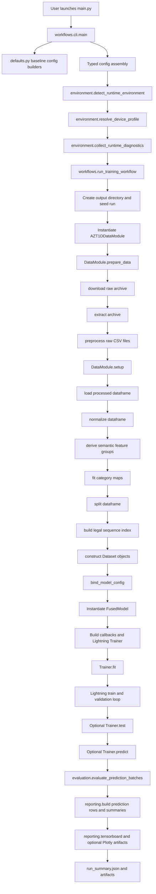
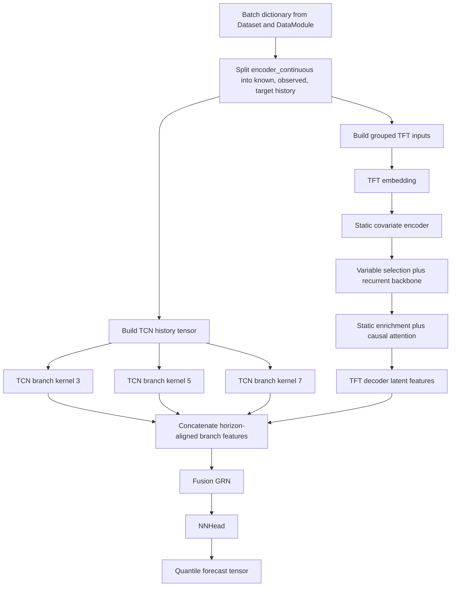

# Repository Primer (Full)

Role: Preserved full-length version of the repository primer for readers who
want one continuous long-form explanation.
Audience: Engineers, contributors, reviewers, and researchers who want one
coherent deep read before diving into narrower docs.
Owns: Extended systems narrative, conceptual flow, and orientation guidance.
Related docs: [`../../README.md`](../../README.md),
[`../system_walkthrough.md`](../system_walkthrough.md),
[`../current_architecture.md`](../current_architecture.md),
[`../codebase_evolution.md`](../codebase_evolution.md),
[`../repository_primer.md`](../repository_primer.md),
[`../research/dataset.md`](../research/dataset.md),
[`../research/methods.md`](../research/methods.md).

If the root `README.md` is the interface to the repository, the recommended
next reads are now [`../system_walkthrough.md`](../system_walkthrough.md) and
[`../repository_primer.md`](../repository_primer.md). This file preserves the
older continuous, essay-style treatment of the repository.

Use [`current_architecture.md`](../current_architecture.md) when you need the
authoritative current package boundaries, runtime ownership, or artifact
policy. This primer intentionally overlaps with some of those topics because it
is written as an onboarding lens, but it prioritizes conceptual flow and
systems understanding over acting as the canonical fact owner.

## Overview

This document is a formal, repository-scale primer intended to explain the
entire codebase at a level suitable for a serious long-form reading. Its
purpose is not merely to describe individual files, but to explain the
repository as a system: its research objective, architectural decomposition,
execution flow, data contracts, model logic, runtime policy, evaluation
methodology, and artifact surface.

The repository implements a research-oriented probabilistic glucose forecasting pipeline centered on a fused Temporal Convolutional Network (TCN) and Temporal Fusion Transformer (TFT) architecture. The implementation is layered deliberately. Raw dataset acquisition, preprocessing, semantic feature typing, window indexing, model construction, runtime profile resolution, training orchestration, structured evaluation, observability, and reporting are separated into distinct packages so that the code can be understood, tested, and extended without collapsing into a monolithic script.

This primer is written for a reader who wants to understand not only "what the files are called," but also:

- where execution begins
- why the execution order is the way it is
- how data changes shape as it moves through the system
- why runtime-bound configuration exists
- how the hybrid model performs inference
- how Lightning fits into the stack
- how evaluation differs from observability
- how to navigate the codebase efficiently afterward

Important disclaimer:
this repository is a research codebase for probabilistic glucose forecasting. It is not a clinically validated medical decision-support system.

## 1. Introduction

### 1.1 Document Aim

The immediate purpose of this primer is to serve as the repository's main
architectural reading companion after the README. The longer-term purpose is to
reduce onboarding cost. A codebase of this kind is difficult to understand if
approached file by file without a systems view. This document therefore
proceeds from system-level intent down to individual packages, interfaces, and
algorithms.

### 1.2 Intended Reader

The intended reader is someone who may already know some Python, but is still developing intuition for:

- time-series forecasting
- probabilistic prediction
- PyTorch Lightning training structure
- multi-package repository architecture

Accordingly, the document aims for professional and academically neutral prose without assuming prior familiarity with every modeling technique used in the repository.

### 1.3 Scope

This document covers:

- the research problem framing implemented by the repository
- the architectural layering of the source tree
- the end-to-end control flow of a normal run
- the data lifecycle from raw archive to model batch
- the semantic feature contract
- the model architecture and forward pass
- the training loop semantics delegated to Lightning
- the detailed evaluation path
- the observability and reporting path
- navigation guidance and external references

This document does not attempt to:

- prove empirical superiority of the model
- provide a clinical interpretation of outputs
- replace source-level reading when implementation detail matters

When this primer overlaps with the present-state reference, treat
[`current_architecture.md`](../current_architecture.md) as the source of truth for
exact current boundaries and behavior.

## 2. Problem Statement

At the highest level, the repository addresses the following research problem:

> Given a historical sequence of glucose and related covariates, estimate the future glucose trajectory over a forecast horizon, while preserving some representation of predictive uncertainty rather than emitting only one point estimate.

Three characteristics of that statement are essential:

### 2.1 Sequential Nature

The repository is not solving an ordinary row-wise supervised learning problem. Each prediction depends on a history window, future-known covariates, and a forecast horizon. That is why concepts such as encoder length, decoder horizon, causal convolutions, variable selection, and temporal attention appear throughout the codebase.

### 2.2 Probabilistic Target

The model does not only output one predicted glucose value per horizon step. It emits multiple quantiles, which are interpreted as low, central, and high forecasts. This is the mathematical reason that pinball loss and quantile-aware evaluation are central to the implementation.

### 2.3 System-Level Scope

The problem is not simply "implement a neural network." The repository must also:

- acquire and clean a real dataset
- establish a stable semantic feature contract
- support multiple runtime environments
- leave reproducible artifacts after a run
- support post-run evaluation beyond training-time logging

That broader system requirement explains the codebase's layered architecture.

## 3. System Overview

Before examining any package in detail, it is useful to compress the entire repository into one conceptual sentence:

> The repository converts a raw glucose dataset into semantically typed sequence windows, binds those runtime-discovered data facts into a hybrid TCN-TFT forecasting model, delegates the epoch loop to PyTorch Lightning, and then performs structured evaluation plus observability- and reporting-driven artifact generation from the resulting probabilistic forecasts.

That sentence already contains the repository's most important causal chain:

1. raw files
2. canonical processed data
3. typed sequence windows
4. runtime-bound config
5. model construction
6. Lightning training
7. evaluation and observability artifacts

If this order is understood, the rest of the repository becomes much easier to interpret.

## 4. Design Principles

The repository's current shape is not accidental. It reflects several recurring architectural principles that are visible throughout the source tree.

### 4.1 Separation of concerns

The code distinguishes between:

- declarative configuration
- runtime environment policy
- data preparation
- model behavior
- training orchestration
- evaluation
- observability

The practical consequence is that the user-facing entrypoint remains thin, while the deeper logic lives in smaller packages with narrower responsibilities.

### 4.2 Semantic Data Contracts

The repository prefers semantically grouped inputs to anonymous raw tensors. This is especially important for the TFT branch, where the model needs to know which variables are:

- static
- known in advance
- historically observed
- targets

This design reduces leakage risk and makes the model contract more explicit.

### 4.3 Runtime-Bound Construction

The repository does not assume that all model-relevant information is known at startup. Some facts, such as categorical vocabulary sizes and final feature cardinalities, are discoverable only after the data has been prepared and inspected. Therefore, the DataModule participates in model binding.

### 4.4 Post-Run Evaluation

Training-time metrics are not treated as the entire evaluation story. The repository computes a richer held-out evaluation after prediction so that raw quantile outputs, aligned targets, and metadata can all contribute to the final assessment.

### 4.5 First-Class Observability

The repository does not reduce observability to print statements. It provides a dedicated package for logging, callback-driven instrumentation, TensorBoard integration, profiler setup, and run summaries.

### 4.6 Reporting As A Separate Projection Layer

The repository now treats reporting as adjacent to observability rather than identical to it. Observability captures run-time signals and logging policy; reporting reshapes predictions and evaluation outputs into tables, summaries, and lightweight figures suitable for inspection after or alongside a run.

## 5. Repository Structure

The following simplified tree captures the major source areas:

```text
defaults.py
main.py
main.ipynb
docs/
src/
  config/
  data/
  environment/
  evaluation/
  models/
  observability/
  reporting/
  train.py
  workflows/
tests/
```

The most useful way to understand this layout is by responsibility.

### 5.1 Root Entry Points

Files:

- [`../main.py`](../../main.py)
- [`../defaults.py`](../../defaults.py)
- `main.ipynb`

Responsibilities:

- preserve a stable top-level runnable surface
- supply baseline configuration builders
- forward execution into the deeper workflow layer

The root files are intentionally thin. Their function is not to contain the system's substantive logic, but to provide stable public entrypoints.

### 5.2 Configuration Package

Representative files:

- [`../src/config/data.py`](../../src/config/data.py)
- [`../src/config/model.py`](../../src/config/model.py)
- [`../src/config/runtime.py`](../../src/config/runtime.py)
- [`../src/config/observability.py`](../../src/config/observability.py)

Responsibilities:

- define typed configuration contracts
- validate those contracts early
- make configuration serializable and inspectable

This package expresses what the system should try to do.

### 5.3 Runtime Package

Representative files:

- [`../src/environment/detection.py`](../../src/environment/detection.py)
- [`../src/environment/profiles.py`](../../src/environment/profiles.py)
- [`../src/environment/diagnostics.py`](../../src/environment/diagnostics.py)
- [`../src/environment/tuning.py`](../../src/environment/tuning.py)

Responsibilities:

- detect the host environment
- choose environment-appropriate defaults
- run preflight diagnostics
- apply low-level backend tuning

This package expresses what the current machine can do and how the repository should adapt.

### 5.4 Data Package

Representative files:

- [`../src/data/downloader.py`](../../src/data/downloader.py)
- [`../src/data/preprocessor.py`](../../src/data/preprocessor.py)
- [`../src/data/transforms.py`](../../src/data/transforms.py)
- [`../src/data/schema.py`](../../src/data/schema.py)
- [`../src/data/indexing.py`](../../src/data/indexing.py)
- [`../src/data/dataset.py`](../../src/data/dataset.py)
- [`../src/data/datamodule.py`](../../src/data/datamodule.py)

Responsibilities:

- acquire raw data
- canonicalize raw columns
- normalize processed dataframes
- define semantic feature groupings
- split data and build legal sequence windows
- assemble model-facing samples
- expose DataLoaders and runtime-discovered cardinalities

This package expresses how raw data becomes a valid model input contract.

### 5.5 Model Package

Representative files:

- [`../src/models/fused_model.py`](../../src/models/fused_model.py)
- [`../src/models/tcn.py`](../../src/models/tcn.py)
- [`../src/models/tft.py`](../../src/models/tft.py)
- [`../src/models/grn.py`](../../src/models/grn.py)
- [`../src/models/nn_head.py`](../../src/models/nn_head.py)

Responsibilities:

- define the forecasting architecture
- perform forward inference
- define the probabilistic loss
- define optimizer construction
- expose Lightning hooks for train/val/test/predict

This package expresses how grouped tensors become probabilistic forecasts.

### 5.6 Training Wrapper

File:

- [`../src/train.py`](../../src/train.py)

Responsibilities:

- build the model after data inspection
- build Lightning callbacks
- build Lightning `Trainer`
- coordinate fit/test/predict operations

This file is the bridge between repository semantics and Lightning mechanics.

### 5.7 Workflow Package

Representative files:

- [`../src/workflows/cli.py`](../../src/workflows/cli.py)
- [`../src/workflows/training.py`](../../src/workflows/training.py)
- [`../src/workflows/helpers.py`](../../src/workflows/helpers.py)
- [`../src/workflows/types.py`](../../src/workflows/types.py)

Responsibilities:

- parse CLI input
- build structured configuration bundles
- run top-level workflow logic
- coordinate artifact writing
- share one orchestration surface between script and notebook contexts

This package expresses how the entire repository behaves as one experiment pipeline.

### 5.8 Evaluation Package

Representative files:

- [`../src/evaluation/core.py`](../../src/evaluation/core.py)
- [`../src/evaluation/metrics.py`](../../src/evaluation/metrics.py)
- [`../src/evaluation/grouping.py`](../../src/evaluation/grouping.py)
- [`../src/evaluation/evaluator.py`](../../src/evaluation/evaluator.py)
- [`../src/evaluation/types.py`](../../src/evaluation/types.py)

Responsibilities:

- normalize prediction/target tensors
- compute scalar metrics
- compute grouped metrics by horizon, subject, and glucose range
- return structured evaluation results

This package expresses how forecasts are judged after they have been produced.

### 5.9 Observability Package

Representative files:

- [`../src/observability/runtime.py`](../../src/observability/runtime.py)
- [`../src/observability/callbacks.py`](../../src/observability/callbacks.py)
- [`../src/observability/debug_callbacks.py`](../../src/observability/debug_callbacks.py)
- [`../src/observability/system_callbacks.py`](../../src/observability/system_callbacks.py)
- [`../src/observability/parameter_callbacks.py`](../../src/observability/parameter_callbacks.py)
- [`../src/observability/prediction_callbacks.py`](../../src/observability/prediction_callbacks.py)

Responsibilities:

- construct logger and profiler surfaces
- attach callback-driven instrumentation
- expose a stable callback facade while keeping callback implementations split by responsibility
- log system, parameter, activation, gradient, and prediction-facing signals
- leave readable run telemetry behind

This package expresses how a run becomes inspectable while it is executing.

A key distinction is that observability operates during runtime, while reporting operates after prediction and evaluation have completed.

### 5.10 Reporting Package

Representative files:

- [`../src/reporting/prediction_rows.py`](../../src/reporting/prediction_rows.py)
- [`../src/reporting/report_tables.py`](../../src/reporting/report_tables.py)
- [`../src/reporting/report_text.py`](../../src/reporting/report_text.py)
- [`../src/reporting/builders.py`](../../src/reporting/builders.py)
- [`../src/reporting/tensorboard.py`](../../src/reporting/tensorboard.py)
- [`../src/reporting/plotly_reports.py`](../../src/reporting/plotly_reports.py)

Responsibilities:

- reshape raw predictions into row-oriented tables
- build compact textual and tabular summaries
- project evaluation outputs into TensorBoard-friendly forms
- generate lightweight report artifacts when enabled
- keep post-run reporting logic modular rather than burying it in workflow code

This package expresses how run outputs become readable summaries after model execution.

## 6. Execution Lifecycle

The normal execution lifecycle of the repository is the single most important thing to understand. The following sequence is the operational spine of the codebase.

### 6.1 Primary Sequence

1. The user launches the repository, typically via `python main.py ...`.
2. The CLI layer parses arguments and builds typed configuration objects.
3. The environment layer detects the host and resolves runtime defaults.
4. The workflow layer creates output directories and preflight metadata.
5. The DataModule prepares and loads the dataset.
6. The DataModule discovers runtime facts such as category cardinalities.
7. The trainer wrapper binds those runtime facts into the model config.
8. The fused model is instantiated.
9. PyTorch Lightning runs the epoch loop.
10. The workflow optionally runs held-out test and prediction.
11. The evaluation package computes structured metrics from raw predictions.
12. The observability package exports logs and runtime telemetry, while the evaluation package produces structured metric outputs.
13. The reporting package packages those outputs into a canonical shared-report representation and emits tables, summaries, TensorBoard views, and optional lightweight reports.
14. The workflow writes a compact run summary and may include references to reporting artifacts and structured outputs.

### 6.2 Order Constraints

This order is not interchangeable. In particular:

- the environment must be resolved before the trainer is finalized
- the data must be inspected before the model is bound
- prediction must happen before detailed evaluation
- the prediction table must exist before Plotly reports are generated

This is one of the central architectural themes of the repository: later layers depend on artifacts or facts produced by earlier layers.

## 7. System Flow

A top-to-bottom representation matches the real dependency structure.



## 8. Entry Points

### 8.1 Main Entrypoint

File:

- [`../main.py`](../../main.py)

This file is intentionally minimal. It re-exports a number of public surfaces, including config builders and workflow functions, but its most important role is to preserve the repository's stable entrypoint:

```python
if __name__ == "__main__":
    main()
```

The key architectural point is that `main.py` does not itself contain the heavy workflow logic. It hands control off to `src/workflows/cli.py`.

### 8.2 Default Configuration

File:

- [`../defaults.py`](../../defaults.py)

This module defines baseline builders for:

- top-level data and model config
- training config
- snapshot config
- observability config

It also inserts `src/` into `sys.path` for root-level consumers, which keeps import behavior consistent for the root script, tests, and notebooks.

Important conceptual distinction:

- these defaults are "runnable baseline research defaults"
- they are not claims of optimal experimental settings

### 8.3 CLI Layer

File:

- [`../src/workflows/cli.py`](../../src/workflows/cli.py)

This module performs the following critical handoff:

1. parse flat CLI arguments
2. convert them into typed config objects
3. detect the runtime environment
4. resolve the device profile
5. collect preflight diagnostics
6. dispatch into either:
   - diagnostics-only mode
   - benchmark-only mode
   - full training workflow

This split matters because it keeps command-line handling separate from reusable Python-callable workflow logic.

## 9. Configuration

The repository uses a typed configuration layer rather than passing loosely structured dictionaries through the entire system. This is one of the most important design decisions in the codebase.

### 9.1 Rationale

Typed config objects provide:

- early validation
- explicit field names
- inspectable defaults
- checkpoint-friendly serialization
- a shared contract between layers

The main packages are:

- [`../src/config/data.py`](../../src/config/data.py)
- [`../src/config/model.py`](../../src/config/model.py)
- [`../src/config/runtime.py`](../../src/config/runtime.py)
- [`../src/config/observability.py`](../../src/config/observability.py)

### 9.2 DataConfig

`DataConfig` defines:

- dataset source location
- filesystem layout
- canonical column names
- sequence lengths
- split behavior
- DataLoader behavior
- rebuild and redownload policy

Representative default values from the repository:

- `sampling_interval_minutes = 5`
- `encoder_length = 168`
- `prediction_length = 12`
- `train_ratio = 0.70`
- `val_ratio = 0.15`
- `test_ratio = 0.15`

With 5-minute sampling, the baseline window lengths correspond to:

- 168 historical steps = 14 hours
- 12 future steps = 1 hour

### 9.3 Model Config

`TCNConfig` defines:

- number of temporal input features
- per-block channel widths
- kernel size
- dilation schedule
- dropout
- output horizon and output size

`TFTConfig` defines:

- semantic features
- categorical cardinalities
- hidden size
- attention head count
- dropout
- quantiles
- sequence lengths
- derived input counts

The top-level `Config` groups:

- `data`
- `tft`
- `tcn`

### 9.4 Runtime Config

`TrainConfig` defines execution policy, not model semantics. It includes:

- accelerator and device selection
- precision policy
- gradient clipping
- gradient accumulation
- strategy
- compilation settings
- epoch limits
- deterministic mode
- loop limits
- progress display behavior
- early stopping patience

`SnapshotConfig` defines checkpoint policy, including:

- whether snapshots are enabled
- save directory
- filename template
- monitored metric
- ranking direction
- `save_top_k`
- `save_last`
- weights-only versus full state

### 9.5 ObservabilityConfig

`ObservabilityConfig` defines the visibility policy of a run. It controls:

- TensorBoard logging
- text logging
- CSV fallback logging
- device stats
- learning-rate monitoring
- prediction figures
- system telemetry
- gradient and activation diagnostics
- prediction export
- Plotly reports
- profiler behavior
- artifact paths

This separation is subtle but important:

- `Config`, `TCNConfig`, and `TFTConfig` describe what the model is
- `TrainConfig`, `SnapshotConfig`, and `ObservabilityConfig` describe how a run behaves

## 10. Config Binding

One of the most important non-obvious ideas in the repository is the distinction between declarative configuration and runtime-bound configuration.

### 10.1 Declarative State

This is the configuration created by:

- `defaults.py`
- the CLI layer
- tests
- notebooks

It expresses intent:

- which dataset paths to use
- which sequence lengths to use
- which hyperparameters to request
- which trainer and observability policies to apply

### 10.2 Runtime-Bound State

This is the configuration produced after the DataModule has inspected the actual processed data. It includes runtime-discovered facts such as:

- categorical vocabulary sizes
- final feature specifications
- sequence-aligned TFT input metadata

### 10.3 Architectural Necessity

The fused model cannot be built correctly from the declarative config alone, because the TFT branch requires category cardinalities that only become known after the DataModule fits category maps on the cleaned dataframe.

The key mechanism is:

- `AZT1DDataModule.bind_model_config(...)` in
[`../src/data/datamodule.py`](../../src/data/datamodule.py)

This is the reason the trainer wrapper prepares the DataModule before model construction.

## 11. Runtime Environment

The repository has an unusually explicit runtime layer for a student/research project, and it is worth understanding because it has architectural consequences.

### 11.1 Rationale

Many training failures are not caused by the model or data logic, but by:

- missing packages
- unsupported precision modes
- requesting GPU behavior on CPU-only hosts
- Apple Silicon runtime quirks
- Slurm versus local assumptions

Therefore the repository treats environment resolution as a real subsystem.

### 11.2 Detection

File:

- [`../src/environment/detection.py`](../../src/environment/detection.py)

This module probes:

- operating system
- machine architecture
- CPU characteristics
- installed Python packages
- PyTorch availability
- CUDA availability
- MPS availability
- BF16 support
- Colab hints
- Slurm hints

The output is a normalized `RuntimeEnvironment` object.

### 11.3 Profile Resolution

File:

- [`../src/environment/profiles.py`](../../src/environment/profiles.py)

This module maps the detected environment to one of several repository-specific profiles, such as:

- `local-cpu`
- `local-cuda`
- `apple-silicon`
- `colab-cpu`
- `colab-cuda`
- `slurm-cpu`
- `slurm-cuda`

The profile then applies sensible defaults to:

- `TrainConfig`
- `DataConfig`
- `ObservabilityConfig`

while respecting explicit user overrides.

### 11.4 Diagnostics

File:

- [`../src/environment/diagnostics.py`](../../src/environment/diagnostics.py)

This module converts the resolved runtime choice into actionable diagnostics, for example:

- missing `torch`
- missing `pytorch-lightning`
- requesting GPU without CUDA availability
- invalid precision on a given backend
- contradictory DataLoader settings

### 11.5 Tuning

File:

- [`../src/environment/tuning.py`](../../src/environment/tuning.py)

This module applies backend-level runtime knobs such as:

- MPS environment variables
- float32 matmul precision
- TF32 enablement
- cuDNN benchmark behavior
- intra-op and inter-op thread counts
- optional `torch.compile(...)`

This gives the repository a clear distinction between:

- deciding policy
- applying policy

## 12. Data Acquisition

The data subsystem is the foundation of the entire repository. If the data contract is not understood, the model and training logic will appear arbitrary.

### 12.1 Download

File:

- [`../src/data/downloader.py`](../../src/data/downloader.py)

The downloader performs raw file acquisition only. It does not know:

- dataframe semantics
- subject split policy
- tensor assembly

Its job is to:

- download a remote file via `requests`
- cache it under `data/raw/`
- optionally extract archives into `data/extracted/`
- return a structured `DownloadResult`

This stage exists because raw byte acquisition is conceptually distinct from tabular preprocessing.

### 12.2 Preprocessing

File:

- [`../src/data/preprocessor.py`](../../src/data/preprocessor.py)

The preprocessor converts vendor-shaped AZT1D CSV exports into one canonical processed CSV. It standardizes raw columns into stable internal names such as:

- `subject_id`
- `timestamp`
- `glucose_mg_dl`
- `basal_insulin_u`
- `bolus_insulin_u`
- `correction_insulin_u`
- `meal_insulin_u`
- `carbs_g`
- `device_mode`
- `bolus_type`
- `source_file`

This stage is intentionally narrow. It standardizes raw file layout and column vocabulary without yet deciding how windows will be constructed.

### 12.3 Why Canonicalization Matters

Without canonicalization, every later package would need to remember raw export spelling differences and data-source quirks. By establishing one processed CSV contract, the repository ensures that all later layers speak one stable schema.

## 13. Data Normalization

After the canonical processed CSV exists, the repository performs dataframe-wide normalization.

### 13.1 Loading and Cleaning

File:

- [`../src/data/transforms.py`](../../src/data/transforms.py)

This stage:

- parses timestamps
- parses numeric targets
- drops rows missing subject, timestamp, or target
- sorts by subject and time
- removes exact duplicates
- collapses same-subject same-timestamp collisions
- imputes or fills semantically sparse values
- normalizes categorical strings
- derives cyclical time features

### 13.2 Domain-Specific Fill Policy

The normalization stage is not doing generic missing-value imputation. It makes domain-shaped decisions consistent with the current repository interpretation of AZT1D-style data:

- `basal_insulin_u` behaves like a carried rate across the shared time grid
- event-style quantities such as bolus, correction, meal insulin, and carbs
are zero-filled when no event occurred at a timestep
- `device_mode` is normalized to a small vocabulary
- `bolus_type` remains event-local rather than forward-filled

### 13.3 Time Features

The repository adds known-ahead temporal covariates such as:

- `minute_of_day_sin`
- `minute_of_day_cos`
- `day_of_week_sin`
- `day_of_week_cos`
- `is_weekend`

These encode periodic temporal structure without imposing hard discontinuities from raw integer clock fields.

## 14. Feature Schema

Files:

- [`../src/data/schema.py`](../../src/data/schema.py)
- [`../src/utils/tft_utils.py`](../../src/utils/tft_utils.py)

This is one of the repository's most important conceptual layers.

### 14.1 Role-Aware Features

The repository does not treat every column identically. It assigns each feature to a semantic role because the model should not consume future information that would not be available at inference time.

The main roles are:

- static
- known
- observed
- target

### 14.2 Role Definitions

Static:

- subject-level features that conceptually identify or characterize the series
- do not vary across timesteps within a sample window

Known:

- variables legitimately known in advance for both history and forecast horizon
- typical examples are time-derived calendar or clock features

Observed:

- variables observable only after they happen
- allowed in the encoder history, not in the future horizon

Target:

- the signal the model is trying to forecast

### 14.3 FeatureGroups

`FeatureGroups` in [`../src/data/schema.py`](../../src/data/schema.py) is the bridge between dataframe columns and grouped model tensors. It defines:

- `static_categorical`
- `static_continuous`
- `known_categorical`
- `known_continuous`
- `observed_categorical`
- `observed_continuous`
- plus derived encoder and decoder groupings

### 14.4 Correctness Implications

This semantic grouping prevents a common forecasting mistake: allowing future observed or target information to enter the model as if it were known in advance. The schema layer is therefore not just a convenience. It is part of the repository's leakage-prevention strategy.

## 15. Split and Indexing

Once the dataframe has been normalized and semantically typed, the repository must decide two separate things:

1. which rows belong to train, validation, and test
2. which contiguous windows inside those rows are legal model samples

These are related but not identical problems.

### 15.1 Split Policy

File:

- [`../src/data/indexing.py`](../../src/data/indexing.py)

The repository supports multiple split strategies:

- by subject
- chronologically within each subject
- globally

The baseline defaults correspond to:

- `split_by_subject = False`
- `split_within_subject = True`

This means each subject timeline is split chronologically into train, validation, and test segments.

### 15.2 Why Splitting Is Separate

The split logic decides which rows are available in each dataset partition. It does not yet decide how to turn those rows into model inputs. By isolating split policy, the repository keeps it possible to vary evaluation strategy without rewriting the Dataset implementation.

### 15.3 Contiguous Segments

The forecasting pipeline assumes an expected sampling interval. Therefore, the window indexer must not allow samples to jump across real time gaps.

To enforce this, the indexer:

- groups rows by subject
- sorts them by time
- finds contiguous segments consistent with the expected interval
- constructs windows only inside those segments

### 15.4 SampleIndexEntry

Each legal window is represented by a lightweight `SampleIndexEntry` storing:

- subject ID
- encoder start
- encoder end
- decoder start
- decoder end

This object is one of the cleanest examples of the repository's architectural discipline: it stores the legality of a sample without yet materializing the sample itself.

## 16. Dataset Contract

File:

- [`../src/data/dataset.py`](../../src/data/dataset.py)

This module answers a narrower question than the indexing module:

> Given one legal index entry, what exact tensors should constitute one sample?

### 16.1 Batch Interface

Each sample contains:

- `static_categorical`
- `static_continuous`
- `encoder_continuous`
- `encoder_categorical`
- `decoder_known_continuous`
- `decoder_known_categorical`
- `target`
- `metadata`

This is not an arbitrary dictionary. It is the canonical data-to-model interface of the repository.

### 16.2 Tensor Shapes

After DataLoader collation, the principal tensor shapes are approximately:

```text
static_categorical         [batch, num_static_cat]
static_continuous          [batch, num_static_cont]
encoder_continuous         [batch, encoder_length, num_encoder_cont]
encoder_categorical        [batch, encoder_length, num_encoder_cat]
decoder_known_continuous   [batch, prediction_length, num_known_cont]
decoder_known_categorical  [batch, prediction_length, num_known_cat]
target                     [batch, prediction_length]
```

More specifically:

- `encoder_continuous` packs known history continuous variables, observed
history continuous variables, and target history into one tensor
- `encoder_categorical` packs known and observed categorical history
- decoder inputs contain only known future variables

### 16.3 Metadata

The metadata payload contains sample-tracing information such as:

- subject ID
- encoder start time
- encoder end time
- decoder start time
- decoder end time

This metadata is not part of the computation graph. It exists so evaluation and reporting can later reconstruct which prediction came from which subject and time interval.

## 17. DataModule

File:

- [`../src/data/datamodule.py`](../../src/data/datamodule.py)

The DataModule is the operational coordinator of the data package.

### 17.1 Lightning Boundary

PyTorch Lightning expects a separation between:

- side effects on disk
- in-memory dataset construction
- DataLoader creation

`AZT1DDataModule` maps cleanly onto this:

- `prepare_data()` handles download/extract/preprocess side effects
- `setup()` builds cleaned dataframes, category maps, split datasets, and
indices
- `train_dataloader()`, `val_dataloader()`, and `test_dataloader()` expose
DataLoaders

### 17.2 Runtime Metadata

The DataModule also fits category vocabularies and stores:

- `category_maps`
- `categorical_cardinalities`

These are needed by the model side, especially the TFT branch, which must know embedding cardinalities.

### 17.3 Config Binding

The method:

- `bind_model_config(...)`

creates a runtime-bound version of the top-level config by injecting:

- feature specifications
- static categorical cardinalities
- known categorical cardinalities
- observed categorical cardinalities
- encoder and example lengths

This is why the DataModule is not merely a DataLoader factory. It is an active participant in the model-construction story.

## 18. Model Binding Dependency

This point merits explicit emphasis because it can surprise readers coming from simpler repositories.

In a simpler system, the model constructor can often be called immediately after parsing CLI arguments. Here, that would be incomplete because the TFT branch needs category cardinalities and finalized feature metadata derived from the actual processed dataset.

The dependency chain is therefore:

1. parse config
2. prepare and load data
3. discover category maps and feature info
4. bind runtime config
5. instantiate the model

This design is not incidental. It encodes the repository's belief that the data contract is upstream of the final model contract.

## 19. Model Overview

The repository's main forecasting model is `FusedModel`:

- [`../src/models/fused_model.py`](../../src/models/fused_model.py)

At a high level, it combines two complementary modeling ideas.

### 19.1 TCN Role

The TCN side is designed to capture local and mid-range temporal structure from history-only signals using causal convolutions and residual temporal blocks.

### 19.2 TFT Role

The TFT side is designed to reason over:

- static covariates
- historical observed inputs
- future-known inputs
- target history

using embedding layers, variable selection, recurrent temporal encoding, static enrichment, and temporal attention.

### 19.3 Fusion Role

Rather than forcing one branch to fully dominate the other, the repository constructs horizon-aligned latent features from both families and combines them before final quantile prediction.

This is why the architecture is not "TCN versus TFT." It is a late-fusion hybrid.

## 20. TCN Branch

File:

- [`../src/models/tcn.py`](../../src/models/tcn.py)

### 20.1 Architectural Role

The TCN branch is history-only. It does not process future-known decoder covariates. Its role is to extract temporal patterns from the encoder history.

### 20.2 Core mechanics

The TCN implementation uses:

- causal `Conv1d`
- residual temporal blocks
- dilation scheduling
- channel-wise layer normalization
- dropout

Causality matters because forecasting must not allow a representation at time `t` to depend on future timesteps.

### 20.3 Multi-kernel design

The fused model instantiates three TCN branches:

- kernel size 3
- kernel size 5
- kernel size 7

The idea is to expose multiple receptive-field biases over the same encoder history.

### 20.4 Output Interface

The TCN class provides:

- `forward_features(...) -> [batch, prediction_length, branch_hidden_size]`
- `forward(...) -> [batch, prediction_length, output_size]`

The fused model uses `forward_features(...)` because it wants branch-aligned representations for fusion rather than branch-local scalar outputs alone.

## 21. TFT Branch

File:

- [`../src/models/tft.py`](../../src/models/tft.py)

The TFT file is longer and structurally denser than most other model files in the repository. That complexity is expected because TFT is doing more than a plain temporal convolution stack.

### 21.1 Embedding Stage

The TFT first embeds:

- static categorical inputs
- static continuous inputs
- known temporal categorical inputs
- known temporal continuous inputs
- observed temporal categorical inputs
- observed temporal continuous inputs
- target history

The embedding block preserves a variable axis because later variable-selection networks need to score variables individually.

### 21.2 Static Context

The static encoder converts embedded static inputs into context vectors used by later stages of TFT. These contexts influence:

- variable selection
- static enrichment
- recurrent initialization

### 21.3 Temporal Assembly

The TFT receives:

- historical inputs over the encoder axis
- future-known inputs over the decoder axis

Historical inputs include:

- known temporal inputs on the encoder timeline
- observed-only temporal inputs on the encoder timeline
- target history on the encoder timeline

Future inputs include:

- only variables legitimately known ahead of time

### 21.4 Temporal Backbone

The TFT temporal backbone performs:

- variable selection
- recurrent encoding
- static enrichment
- causal self-attention
- position-wise processing
- decoder-side residual refinement

It returns both:

- horizon-aligned latent decoder features
- direct quantile outputs

The fused model consumes the latent decoder features.

### 21.5 Why Grouping Persists

The TFT is the primary reason the repository invests heavily in semantic feature roles. Unlike a simpler model that might tolerate flat concatenation, TFT gains architectural value from knowing which variables are static, known, observed, or target-bearing.

## 22. FusedModel

File:

- [`../src/models/fused_model.py`](../../src/models/fused_model.py)

The fused model is the center of the repository's modeling story.

### 22.1 Constructor

The constructor does more than instantiate submodules. It:

- normalizes checkpoint-friendly config payloads
- binds a runtime-aware TFT config
- derives input counts for branch splitting
- builds three TCN branches
- builds the TFT branch
- materializes lazy TFT parameters so Lightning can configure optimizers
- builds the fusion GRN
- builds the final prediction head
- stores quantiles
- sets up train/val/test metrics

### 22.2 Branch Inputs

The model deliberately gives different information budgets to the branches:

- TCN receives only encoder-side observed continuous history and target history
- TFT receives the semantically grouped static, historical, and future-known
inputs

This division reflects the intended strengths of the two model families.

### 22.3 Fusion Stage

The horizon-aligned outputs of:

- TFT
- TCN-3
- TCN-5
- TCN-7

are concatenated along the feature dimension and passed through a GRN before the final MLP-style head emits quantile predictions.

This means fusion happens in latent representation space rather than after the TFT branch has already reduced itself to final probabilistic outputs.

## 23. Forward Pass

This section presents the model algorithm in sequential form.

### 23.1 Inputs

The fused model receives a batch dictionary with keys:

```python
{
    "static_categorical": ...,
    "static_continuous": ...,
    "encoder_continuous": ...,
    "encoder_categorical": ...,
    "decoder_known_continuous": ...,
    "decoder_known_categorical": ...,
    "target": ...,
}
```

### 23.2 Continuous Split

The packed `encoder_continuous` tensor is split into:

- known history continuous
- observed history continuous
- target history

This split is required because TCN and TFT use different subsets.

### 23.3 Categorical Split

The packed `encoder_categorical` tensor is split into:

- known history categorical
- observed history categorical

### 23.4 TCN Input

The TCN input is:

```text
[observed_history_continuous | target_history]
```

Shape intuition:

```text
[batch, encoder_length, num_observed_cont + num_target]
```

### 23.5 TCN Branch Execution

Each branch produces:

```text
[batch, prediction_length, branch_hidden_size]
```

The branches differ only in kernel size, giving multiple temporal scales over the same encoder history.

### 23.6 TFT Input Assembly

The TFT input dictionary contains:

- static categorical
- static continuous
- known categorical over the full example axis
- known continuous over the full example axis
- observed categorical over the encoder axis
- observed continuous over the encoder axis
- target history over the encoder axis

The known temporal groups are assembled by concatenating:

- encoder-known history
- decoder-known future inputs

along the time axis to reconstruct the full example sequence expected by TFT.

### 23.7 TFT Feature Extraction

The fused model calls:

- `self.tft.forward_features(...)`

This returns:

```text
[batch, prediction_length, tft_hidden_size]
```

These are decoder-aligned latent features, not yet final quantile outputs.

### 23.8 Feature Concatenation

The model concatenates:

- TFT decoder features
- TCN-3 features
- TCN-5 features
- TCN-7 features

along the feature dimension.

This is valid because all four tensors are already aligned on:

- batch dimension
- horizon dimension

### 23.9 Apply fusion GRN

The concatenated latent tensor is passed through a GRN which performs a gated, nonlinear feature fusion.

### 23.10 Prediction Head

The fused latent tensor is passed through `NNHead`, which emits:

```text
[batch, prediction_length, num_quantiles]
```

By default the quantile set is:

- `0.1`
- `0.5`
- `0.9`

### 23.11 Output Interpretation

The output tensor means:

- for each sample in the batch
- for each future horizon step
- predict several quantile values of future glucose

That is the model's probabilistic forecast contract.

## 24. Forward Flow



## 25. Optimization and Lightning

The model is implemented as a `LightningModule`, so understanding training requires distinguishing between:

- what the model itself owns
- what Lightning owns

### 25.1 Model-Owned Logic

`FusedModel` owns:

- the forward pass
- quantile loss computation
- point-forecast extraction
- train/val/test shared supervision logic
- optimizer construction
- prediction output semantics

### 25.2 Quantile loss

Training uses pinball loss over the quantile channels. This is the standard loss for quantile regression and teaches each output channel to represent a different part of the predictive distribution.

### 25.3 Point metrics

For human-readable summaries, the model also computes point metrics such as:

- MAE
- RMSE

These are usually derived from the median prediction (or nearest configured quantile to 0.5).

### 25.4 Lightning Hooks

The model implements:

- `training_step(...)`
- `validation_step(...)`
- `test_step(...)`
- `predict_step(...)`
- `configure_optimizers(...)`

The train/validation/test hooks all delegate to a shared internal helper so that supervision semantics remain aligned.

### 25.5 Lightning-Owned Execution

Once the trainer wrapper calls `Trainer.fit(...)`, Lightning takes over:

- the epoch loop
- batching
- backpropagation
- optimizer stepping
- mixed precision machinery
- gradient accumulation
- validation scheduling
- callback dispatch
- checkpoint writing

The repository's architecture is designed around this delegation. It builds the right model and runtime context first, then hands the actual loop mechanics to Lightning.

## 26. Trainer Wrapper

File:

- [`../src/train.py`](../../src/train.py)

The trainer wrapper is one of the most important integration layers in the repository.

### 26.1 Purpose

Without this wrapper, `main.py` or the notebook would need to repeat:

- DataModule preparation
- model binding
- callback construction
- logger setup
- checkpoint policy
- Trainer assembly
- fit/test/predict control flow

The wrapper centralizes those responsibilities.

### 26.2 Fit Sequence

1. Prepare the DataModule.
2. Bind runtime config from the DataModule.
3. Instantiate `FusedModel`.
4. Optionally compile the model.
5. Check split availability.
6. Build callbacks.
7. Build the Lightning `Trainer`.
8. Log hyperparameters.
9. Call `trainer.fit(...)`.
10. Cache the best checkpoint path.

### 26.3 Eager Data Preparation

In a simpler Lightning project, one might allow the trainer to call DataModule hooks lazily. Here that is insufficient because model construction depends on post-setup DataModule state. The wrapper therefore performs that preparation early and deliberately.

### 26.4 Evaluation-Only Limitation

The current design is strongest for the common pattern:

1. fit
2. test
3. predict

The wrapper's in-memory test and prediction helpers assume that `fit()` has run already. Pure checkpoint-only evaluation without a prior fit session is not yet the repository's primary path.

## 27. Workflow Orchestration

File:

- [`../src/workflows/training.py`](../../src/workflows/training.py)

The workflow layer sits one level above the trainer wrapper.

### 27.1 Added Responsibilities

The workflow layer adds:

- output directory creation
- seed management
- profile resolution for direct Python callers
- preflight diagnostics
- top-level exception analysis
- post-fit test and prediction orchestration
- structured evaluation
- prediction tensor export
- reporting-table export
- TensorBoard-facing reporting projection
- optional Plotly/lightweight report generation
- run summary writing

### 27.2 Run summary

The workflow builds a JSON-ready summary containing:

- timestamp
- output directory
- config objects
- optimizer settings
- requested and resolved device profiles
- runtime environment
- preflight diagnostics
- fit artifacts
- evaluation outputs
- prediction artifact locations
- observability artifact locations

This is the compact, inspectable memory of a run.

### 27.3 Benchmark Path

The workflow package also supports a shortened benchmark path that:

- reduces observability overhead
- limits training batches
- performs timing and memory measurement

This is an example of architectural reuse: the benchmark reuses the real training stack rather than becoming a separate miniature framework.

## 28. Call Graph

The repository becomes much easier to understand once the call graph is written explicitly.

### 28.1 Primary Call Chain

```text
python main.py
  -> main.py::__main__
  -> workflows.cli.main(...)
  -> workflows.cli._build_cli_configuration(...)
  -> environment.detect_runtime_environment(...)
  -> environment.resolve_device_profile(...)
  -> environment.collect_runtime_diagnostics(...)
  -> workflows.training.run_training_workflow(...)
  -> AZT1DDataModule(...)
  -> FusedModelTrainer(...)
  -> FusedModelTrainer.fit(...)
  -> datamodule.prepare_data()
  -> datamodule.setup()
  -> datamodule.bind_model_config(...)
  -> FusedModel(...)
  -> Trainer.fit(...)
  -> FusedModel.training_step(...)
  -> FusedModel.forward(...)
```

After fitting completes:

```text
run_training_workflow(...)
  -> trainer.test(...)
  -> trainer.predict_test(...)
  -> evaluation.evaluate_prediction_batches(...)
  -> reporting.build_prediction_rows(...)
  -> reporting.write_tensorboard_artifacts(...)
  -> reporting.generate_plotly_reports(...)
  -> write run_summary.json
```

### 28.2 Call-Graph Significance

The call graph makes visible a central repository dependency:

- data preparation is upstream of model instantiation

That dependency explains many architectural choices that otherwise look surprising.

## 29. Dependency Hierarchy

The repository depends on different kinds of dependencies:

### 29.1 Software Dependencies

From [`../../requirements.txt`](../../requirements.txt):

- `torch`
- `pytorch-lightning`
- `torchmetrics`
- `numpy`
- `pandas`
- `matplotlib`
- `plotly`
- `psutil`
- `requests`
- `tensorboard`
- `torchview`
- `pytest`

### 29.2 Stage Dependencies

The execution stages form a dependency hierarchy:

1. `torch` and `pytorch-lightning` must be installed
2. configuration must be assembled
3. environment policy must be resolved
4. raw data must be available or downloadable
5. processed data must be built
6. normalized dataframe must be loaded
7. category maps and split datasets must be built
8. runtime config must be bound
9. the model can be instantiated
10. Lightning can execute the training loop
11. predictions can be generated
12. detailed evaluation can be computed
13. reports can be generated from exported tables

### 29.3 Critical "must happen before" edges

- download before preprocessing
- preprocessing before processed-frame loading
- processed-frame loading before split construction
- split construction before sequence indexing
- sequence indexing before Dataset assembly
- DataModule setup before runtime model binding
- runtime model binding before `FusedModel` construction
- fit before current in-memory test/predict usage
- predict before detailed evaluation
- prediction table export before Plotly report generation

## 30. Evaluation

The repository's evaluation package deserves separate attention because it is more structured than the training-time metric surface.

### 30.1 Why Evaluation Is Separate

Training-time logs answer:

- "How is training progressing?"

Detailed evaluation answers:

- "How good are the held-out forecasts as a structured prediction object?"

These are not identical questions.

### 30.2 Canonical Shapes

The evaluation package standardizes on:

```text
predictions      [batch, horizon, quantiles]
target           [batch, horizon]
point_prediction [batch, horizon]
```

This shape normalization occurs in:

- [`../src/evaluation/core.py`](../../src/evaluation/core.py)

### 30.3 Scalar Metrics

Primitive metrics are implemented in:

- [`../src/evaluation/metrics.py`](../../src/evaluation/metrics.py)

These include:

- MAE
- RMSE
- bias
- pinball loss
- per-quantile pinball loss
- mean prediction interval width
- empirical interval coverage

### 30.4 Grouped Metrics

The evaluator also computes grouped metrics by:

- horizon index
- subject ID
- glucose range

These grouped views matter because one global error summary can hide:

- deterioration at longer horizons
- subject-specific failure modes
- different performance across glucose bands

### 30.5 Result Contracts

The evaluation package returns typed dataclasses such as:

- `EvaluationBatch`
- `MetricSummary`
- `GroupedMetricRow`
- `EvaluationResult`

These types are defined in:

- [`../src/evaluation/types.py`](../../src/evaluation/types.py)

This typed surface keeps evaluation results inspectable and serializable.

## 31. Observability, Reporting, and Artifacts

Observability in this repository is broader than metric logging, but it is also
more structured than it was in earlier snapshots.

### 31.1 Runtime observability

Representative files:

- [`../src/observability/runtime.py`](../../src/observability/runtime.py)
- [`../src/observability/callbacks.py`](../../src/observability/callbacks.py)
- [`../src/observability/debug_callbacks.py`](../../src/observability/debug_callbacks.py)
- [`../src/observability/system_callbacks.py`](../../src/observability/system_callbacks.py)
- [`../src/observability/parameter_callbacks.py`](../../src/observability/parameter_callbacks.py)
- [`../src/observability/prediction_callbacks.py`](../../src/observability/prediction_callbacks.py)

Runtime observability includes:

- TensorBoard or CSV logger construction
- optional text logger
- optional profiler
- callback-driven instrumentation such as:
  - learning-rate monitoring
  - device stats
  - system telemetry
  - batch auditing
  - gradient statistics
  - activation statistics
  - parameter histograms
  - prediction figures
  - model-visualization artifacts

A useful architectural distinction in the current repository is that
observability primarily answers:

- what happened during this run?
- what did the runtime, model, and tensors look like while training proceeded?

### 31.2 Reporting layer

Representative files:

- [`../src/reporting/prediction_rows.py`](../../src/reporting/prediction_rows.py)
- [`../src/reporting/report_tables.py`](../../src/reporting/report_tables.py)
- [`../src/reporting/report_text.py`](../../src/reporting/report_text.py)
- [`../src/reporting/builders.py`](../../src/reporting/builders.py)
- [`../src/reporting/tensorboard.py`](../../src/reporting/tensorboard.py)
- [`../src/reporting/plotly_reports.py`](../../src/reporting/plotly_reports.py)

The reporting layer includes:

- export of flat prediction tables
- compact summary tables
- text summaries for evaluation results
- TensorBoard-friendly report projection
- optional Plotly figures and lightweight HTML outputs when enabled

Importantly, reporting first constructs a canonical shared-report representation (e.g., `SharedReport`), which is then consumed by multiple export and visualization sinks (CSV, JSON, TensorBoard, Plotly).

This layer primarily answers:

- how should the outputs of this run be summarized for later reading?
- which post-run tables and views are worth preserving?

### 31.3 Prediction Table Rationale

The raw `.pt` prediction tensor preserves fidelity for programmatic analysis.
The prediction table serves a different purpose: it denormalizes the result into
a row-oriented format suitable for:

- pandas inspection
- plotting
- manual debugging
- summary generation
- downstream report builders

### 31.4 Artifact Layout

The repository uses two major storage regions during ordinary operation:

- dataset storage under `data/`
- run outputs under `artifacts/`

The default run-output root is defined in [`../defaults.py`](../../defaults.py) as:

```text
artifacts/main_run/
```

Under that default run directory, a typical full execution may produce:

```text
artifacts/main_run/
  checkpoints/
  logs/
  model_viz/
    fused_model*
  profiler/
  reports/
  run.log
  run_summary.json
  telemetry.csv
  test_predictions.pt
  test_predictions.csv
```

More specifically:

- checkpoints are written under `artifacts/main_run/checkpoints/` when snapshotting is enabled
- logger output is rooted under `artifacts/main_run/logs/`
- the plain-text log is typically `artifacts/main_run/run.log`
- telemetry is typically `artifacts/main_run/telemetry.csv`
- exported prediction tables are typically `artifacts/main_run/test_predictions.csv`
- raw prediction tensors are typically `artifacts/main_run/test_predictions.pt`
- reporting outputs, including TensorBoard-linked summaries and optional Plotly artifacts, are typically written under `artifacts/main_run/reports/`
- profiler artifacts, when enabled, are written under `artifacts/main_run/profiler/`
- Torchview/model-visualization artifacts are typically written under `artifacts/main_run/model_viz/`

In addition, newer structured reporting outputs may include:

- `artifacts/main_run/report_index.json`
  a lightweight index of report artifacts and entry points
- `artifacts/main_run/reports/artifacts/shared_report/`
  canonical structured bundle containing:
  - `metrics_summary.json`
  - grouped metric tables (e.g., by horizon, subject, glucose range)
  - scalar summaries and metadata


The dataset lifecycle uses a parallel but separate storage layout:

```text
data/
  raw/
  cache/
  extracted/
  processed/
```

In that layout:

- `data/raw/` stores downloaded archives
- `data/cache/` stores transient download artifacts such as partial files
- `data/extracted/` stores extracted archive contents
- `data/processed/` stores the canonical processed CSV consumed by the DataModule

This explicit storage separation is important. The repository does not mix:

- dataset state
- run artifacts
- checkpoints
- reports

As a result, it is usually possible to answer two different questions quickly:

- "Where is the cleaned dataset?"
- "Where did this particular experiment write its outputs?"

This artifact surface is one of the repository's strongest signs of maturity as
a research system rather than merely a model implementation.

## 32. Navigation

A reader attempting to understand the repository in one sitting should not move alphabetically through the files. A dependency-aware reading order is much more effective.

### 32.1 Recommended reading order

1. [`../main.py`](../../main.py)
2. [`../defaults.py`](../../defaults.py)
3. [`../src/workflows/cli.py`](../../src/workflows/cli.py)
4. [`../src/workflows/training.py`](../../src/workflows/training.py)
5. [`../src/train.py`](../../src/train.py)
6. [`../src/data/datamodule.py`](../../src/data/datamodule.py)
7. [`../src/data/dataset.py`](../../src/data/dataset.py)
8. [`../src/data/indexing.py`](../../src/data/indexing.py)
9. [`../src/models/fused_model.py`](../../src/models/fused_model.py)
10. [`../src/models/tcn.py`](../../src/models/tcn.py)
11. [`../src/models/tft.py`](../../src/models/tft.py)
12. [`../src/evaluation/evaluator.py`](../../src/evaluation/evaluator.py)
13. [`../src/observability/callbacks.py`](../../src/observability/callbacks.py)
14. [`../src/reporting/builders.py`](../../src/reporting/builders.py)

### 32.2 Minimal reading set for rapid orientation

If time is limited, the five most informative files are:

1. [`../src/workflows/training.py`](../../src/workflows/training.py)
2. [`../src/train.py`](../../src/train.py)
3. [`../src/data/datamodule.py`](../../src/data/datamodule.py)
4. [`../src/models/fused_model.py`](../../src/models/fused_model.py)
5. [`../src/evaluation/evaluator.py`](../../src/evaluation/evaluator.py)
6. [`../src/reporting/builders.py`](../../src/reporting/builders.py)

### 32.3 Tests as Evidence

The test tree mirrors the package structure:

- `tests/config/`
- `tests/data/`
- `tests/environment/`
- `tests/models/`
- `tests/evaluation/`
- `tests/observability/`
- `tests/training/`
- `tests/workflows/`

This is valuable for understanding because it reveals which package boundaries the repository considers stable and important enough to test independently.

## 33. Common Questions

### 33.1 Dual Entrypoints

Because the repository wants:

- a stable user-facing script surface
- a reusable internal workflow layer

These are related but not identical needs.

### 33.2 DataModule Scope

Because the model depends on runtime-discovered category cardinalities and feature metadata. The DataModule is therefore part of the model-binding process.

### 33.3 TFT Complexity

Because TFT performs more structurally distinct operations:

- embedding
- variable selection
- static context encoding
- recurrent temporal processing
- attention
- decoder-side processing

The TCN branch is intentionally narrower.

### 33.4 Why Evaluation Follows Prediction

Because Lightning's `test()` path naturally yields reduced scalar outputs, while the repository's detailed evaluation requires raw quantile predictions plus aligned targets and metadata.

### 33.5 Observability as a Package

Because logger setup, callback-driven instrumentation, profiler setup, and runtime telemetry are too substantial and too reusable to remain scattered across workflow code.

### 33.6 Why Reporting Is Separate From Observability

Because prediction reshaping, tabular summaries, TensorBoard report projection, and optional Plotly artifacts are post-run presentation concerns. Keeping them in `src/reporting/` avoids overloading the observability layer with every artifact-generation responsibility.

## 34. Core Takeaways

If the repository still feels large, the following checklist captures the ten most important conceptual anchors:

1. This is a sequential forecasting system, not a row-wise tabular predictor.
2. The data contract is semantic, not flat.
3. The pipeline distinguishes known, observed, static, and target variables.
4. The DataModule does real semantic work, not only DataLoader work.
5. The model is a late-fusion hybrid of TCN and TFT.
6. TCN handles history-only temporal pattern extraction.
7. TFT handles semantically richer temporal reasoning with future-known inputs.
8. Lightning owns the epoch loop after the repository has prepared the context.
9. Detailed evaluation happens after prediction, not only during training.
10. Observability and artifacts are part of the system's design, not an afterthought.

## 35. Internal References

This primer is best used together with the repository's other architecture documents:

- [`./system_walkthrough.md`](../system_walkthrough.md)
- [`./current_architecture.md`](../current_architecture.md)
- [`./codebase_evolution.md`](../codebase_evolution.md)
- [`./dependency_graphs/summary.md`](../dependency_graphs/summary.md)
- [`./dependency_graphs/production_module_graph.svg`](../dependency_graphs/production_module_graph.svg)
- [`./assets/FusedModel_architecture.png`](../assets/FusedModel_architecture.png)
- [`./assets/TCN_architecture.png`](../assets/TCN_architecture.png)
- [`./assets/TFT_architecture.PNG`](../assets/TFT_architecture.PNG)

The role of those documents is complementary:

- `system_walkthrough.md` is the guided second-pass read after the README
- this primer preserves the longer continuous systems monograph
- `current_architecture.md` gives a point-in-time architecture summary
- `codebase_evolution.md` explains how the repository acquired its present shape
- dependency graphs provide static structural evidence

## 36. External References

The following references are useful for understanding the repository's major ideas. They are not exact one-to-one descriptions of this implementation, but they provide important theoretical or framework context.

### 36.1 Dataset

- AZT1D dataset page:
https://data.mendeley.com/datasets/gk9m674wcx/1

### 36.2 PyTorch and Lightning

- PyTorch documentation:
https://pytorch.org/docs/stable/index.html

- PyTorch Lightning DataModule documentation:
https://lightning.ai/docs/pytorch/stable/data/datamodule.html

- PyTorch Lightning Trainer documentation:
https://lightning.ai/docs/pytorch/stable/common/trainer.html

### 36.3 Modeling References

- Temporal Fusion Transformers paper:
https://arxiv.org/abs/1912.09363

- Google Research publication page for TFT:
https://research.google/pubs/temporal-fusion-transformers-for-interpretable-multi-horizon-time-series-forecasting/

- NVIDIA DeepLearningExamples repository:
https://github.com/NVIDIA/DeepLearningExamples

- `pytorch-tcn` repository:
https://github.com/paul-krug/pytorch-tcn

### 36.4 Metrics and Reporting

- TorchMetrics documentation:
https://lightning.ai/docs/torchmetrics/stable/

- TensorBoard documentation:
https://www.tensorflow.org/tensorboard

- Plotly Python documentation:
https://plotly.com/python/

## 37. Conclusion

The repository is best understood not as "a model" but as a staged forecasting system. Its logic is cumulative:

- raw files are downloaded and extracted
- raw columns are canonicalized
- the processed dataframe is normalized
- semantic feature groups are derived
- split partitions and legal windows are built
- grouped tensors are assembled
- runtime-discovered data facts are bound into the config
- the hybrid model is instantiated
- Lightning executes the train/validation/test machinery
- prediction tensors are evaluated
- artifacts are exported for interpretation

If one sentence must summarize the entire repository, it is the following:

> This codebase is a layered probabilistic forecasting pipeline in which the data contract is established first, runtime facts are bound into the model second, and evaluation plus observability are applied after prediction rather than being treated as secondary concerns.

That sentence is the architectural key to the repository. Once it is internalized, the remainder of the source tree becomes far more intelligible.
