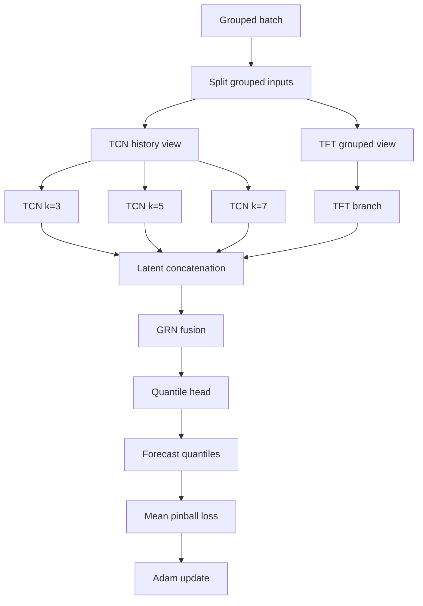

# Methodology

This section describes the forecasting pipeline, model architecture, probabilistic objective, training procedure, experimental configuration, reproducibility settings, and evaluation protocol used in the present study.

## 4.1 Method Framing And Research Positioning

Probabilistic glucose forecasting is formulated here as a multi-horizon sequence-modeling problem. The methodology is a late-fusion hybrid that combines Temporal Convolutional Network (TCN) branches, a Temporal Fusion Transformer (TFT) branch, a gated residual fusion block, and a quantile forecasting head [1]-[6].

The proposed methodology is a task-specific hybrid forecasting pipeline for glucose prediction. It combines semantically grouped inputs, parallel TCN and TFT latent branches, gated late fusion, and direct quantile supervision so that short-range temporal structure, multivariate contextual information, and predictive uncertainty are handled within a single end-to-end model.

The discussion below concentrates on the methodological design itself, namely the forecasting pipeline, model construction, optimization objective, training workflow, and evaluation setup.

## 4.2 Rationale For Method Choice

The model combines two complementary sequence-modeling families. TCNs provide causal convolutions, dilation, and efficient extraction of short- and mid-range temporal patterns from history-only inputs [2]. TFT provides a structured mechanism for combining static context, historical observations, and future-known covariates in a multi-horizon forecasting setting [1].

Prior hybrid TCN-TFT work in other forecasting domains motivates using both families together rather than forcing one branch to dominate the entire problem [3], [4]. Following that intuition, the present methodology adopts a late-fusion design in which TCN and TFT produce separate horizon-aligned latent representations that meet only at the fusion layer.

Quantile regression is used because glucose forecasting is intrinsically uncertain. A point-only predictor would collapse the output to one central estimate. Quantile prediction instead preserves lower, central, and upper conditional forecasts of the same future trajectory [5], [6].

## 4.3 Forecasting Pipeline

The end-to-end forecasting pipeline can be summarized in six stages:

1. standardize the raw AZT1D source into a cleaned analysis table
2. construct legal encoder-decoder windows without crossing temporal gaps
3. pack each window into grouped tensors with static, known, observed, and target-history roles
4. run three TCN branches and one TFT branch in parallel
5. concatenate the horizon-aligned latent features and fuse them with a GRN
6. emit per-horizon quantile forecasts and evaluate them on held-out data

## 4.4 Model Architecture

The model used in this study is `FusedModel`, a late-fusion hybrid composed of one TFT branch, three TCN branches, one post-branch GRN, and one final quantile head.

### 4.4.1 Input Representation

The model receives grouped batch tensors rather than one flat feature matrix. The input representation is organized into four semantic roles:

- static features
- known-ahead temporal features
- observed-only temporal features
- target history

This grouping matters because the TCN and TFT branches do not consume identical information budgets. The grouped batch contract preserves causal availability instead of flattening every feature into one anonymous input tensor.

Default sequence lengths are:

- encoder length \(L_e = 168\)
- prediction length \(L_d = 12\)
- sampling interval = 5 minutes

That corresponds to 14 hours of history and 1 hour of forecast horizon in the default configuration. Detailed feature definitions and batch-shape conventions are provided in [`dataset.md`](dataset.md).

### 4.4.2 Temporal Convolutional Branch

The TCN side consumes only encoder-side observed continuous signals together with target history. The architecture uses three parallel branches with kernel sizes `3`, `5`, and `7`, so that the same history can be viewed through multiple receptive-field biases.

The shared default TCN configuration is:

| channels | dilations | dropout | normalization | prediction length |
|---|---|---|---|---|
| `(64, 64, 128)` | `(1, 2, 4)` | `0.1` | `layer_norm` | `12` |

Each branch is causal and produces horizon-aligned latent features rather than final quantile outputs [2].

### 4.4.3 Temporal Fusion Transformer Branch

The TFT branch consumes grouped static features, encoder history, and decoder-known future inputs [1]. Unlike the TCN path, it is explicitly designed to preserve semantic feature roles across the encoder-decoder example axis.

The default TFT hyperparameters are:

| hidden size | attention heads | dropout | attention dropout | layer norm epsilon | encoder length | total sequence length |
|---|---|---|---|---|---|---|
| `128` | `4` | `0.1` | `0.0` | `1e-3` | `168` | `180` |

Categorical embedding cardinalities and several variable counts are determined from the prepared dataset rather than fixed a priori, so the model remains aligned with the realized feature schema of a given run.

### 4.4.4 Latent Fusion Mechanism

The decoder-aligned TFT latent representation is concatenated with the three TCN branch representations along the feature dimension. A GRN, adapted from the TFT design, then compresses the concatenated tensor back to the shared hidden width and acts as the nonlinear gated fusion block [1], [4].

This is a late-fusion method. Fusion occurs in latent space before the final prediction head, rather than after separate probabilistic forecasts are produced by each branch.

### 4.4.5 Quantile Forecasting Head

The fused hidden state is passed to a position-wise residual MLP head (`NNHead`) that emits one output channel per requested quantile at each horizon step.

The default head configuration is:

| input size | hidden size | feedforward size | residual blocks | dropout | quantiles |
|---|---|---|---|---|---|
| `128` | `128` | `256` | `2` | `0.1` | `(0.1, 0.5, 0.9)` |

The output tensor therefore has shape \([B, L_d, |\mathcal{Q}|]\), where \(\mathcal{Q}\) is the configured quantile set.

## 4.5 Probabilistic Learning Objective

Training uses pinball loss, also called quantile loss, over the forecast quantile tensor [5], [6]. For one target value \(y\), one predicted quantile \(\hat{y}_q\), and one quantile level \(q\), the loss is:

\[
\mathcal{L}_q(y, \hat{y}_q) =
\begin{cases}
q(y - \hat{y}_q), & y \ge \hat{y}_q \\
(1 - q)(\hat{y}_q - y), & y < \hat{y}_q
\end{cases}
\]

For the configured quantile set \(\mathcal{Q}\) and prediction horizon \(L_d\), the overall objective is the mean loss over batch items, horizon steps, and quantile channels:

\[
\mathcal{L} =
\frac{1}{|\mathcal{Q}|L_d}
\sum_{q \in \mathcal{Q}}
\sum_{\tau=1}^{L_d}
\mathcal{L}_q(y_{t+\tau}, \hat{y}_{t+\tau,q})
\]

At \(q = 0.5\), the objective corresponds to median estimation. The outer quantiles define lower and upper conditional cutoffs of the same future target. Metric interpretation is discussed separately in [`results_and_discussion.md`](results_and_discussion.md).

## 4.6 Training Procedure

Each training step follows the same branch-and-fuse pattern. The grouped batch is first partitioned into the views required by the TCN and TFT branches, then the branch features are fused, projected into quantiles, and supervised with pinball loss.

Concretely, the split step means that encoder-side tensors are routed into two branch-specific views: a history-only TCN input built from observed continuous variables and target history, and a semantically grouped TFT input built from static, historical, and future-known covariates. Training is executed through PyTorch Lightning, which manages batching, backpropagation, validation scheduling, callback dispatch, and checkpoint management, while the model defines the forward pass, loss computation, step logic, and optimizer construction.

## 4.7 Hyperparameters And Experimental Configuration

The table below reports the baseline experimental configuration used for model training and evaluation.

| sampling interval | encoder length | prediction length | window stride | split ratio | split mode | batch size | optimizer | learning rate | weight decay | max epochs | early stopping patience | quantiles |
|---|---|---|---|---|---|---|---|---|---|---|---|---|
| `5` minutes | `168` | `12` | `1` | `70 / 15 / 15` | within-subject chronological | `64` | `Adam` | `1e-3` | `0.0` | `20` | `5` validation checks | `(0.1, 0.5, 0.9)` |

These values provide the reference configuration for the present experiments.

## 4.8 Reproducibility And Runtime Traceability

Reproducibility depends on distinguishing between declarative configuration and runtime-bound configuration. Declarative settings are defined at the experiment entry point, whereas runtime-bound settings are resolved only after the prepared dataset has been inspected and feature-dependent metadata has been bound.

This distinction is methodologically important because the TFT branch depends on runtime-derived categorical and sequence information. Data preparation therefore precedes final model construction.

The default artifact directory is `artifacts/main_run/`. A run can emit:

- `run_summary.json`
- `report_index.json`
- `metrics_summary.json`
- checkpoints
- logs and telemetry
- profiler outputs
- structured post-run reports

Together, these artifacts provide a traceable record of the effective configuration, optimizer settings, runtime choices, and evaluation outputs associated with each run.

## 4.9 Evaluation Protocol

The experimental protocol uses a `70 / 15 / 15` split with within-subject chronological partitioning. Each legal sample contains `168` historical steps and `12` future target steps on a 5-minute grid.

Held-out evaluation is performed on the forecast quantile tensor rather than on scalar test loss alone. The standard metric set includes:

- MAE on the median-like forecast
- RMSE on the median-like forecast
- pinball loss on the full quantile output
- prediction-interval width
- empirical interval coverage

Additional grouped evaluations by horizon, subject, and glucose range can also be generated, with their interpretation discussed in [`results_and_discussion.md`](results_and_discussion.md).

## 4.10 Validation And Sanity Checks

Several method-side safeguards are built into the forecasting pipeline:

- causal TCN convolutions prevent future leakage through the convolutional path
- decoder inputs to TFT are restricted to future-known covariates
- legal windows cannot cross temporal discontinuities in the cleaned timeline
- runtime metadata binding keeps model dimensions aligned with the prepared data
- quantile tensors are checked against the configured quantile set during loss and evaluation paths
- validation loss can be used to drive checkpoint ranking and early stopping

These checks do not replace full empirical validation, but they reduce common failure modes such as illegal windows, shape drift, and accidental leakage through the forecasting interface.

## 4.11 Methodological Scope And Constraints

The methodology should be interpreted with several boundaries in mind.

- the reported hyperparameters define a baseline experimental setting, not an exhaustive tuning study
- the default split mode answers a within-subject forecasting question rather than unseen-subject generalization
- `window_stride = 1` produces heavily overlapping windows
- the default quantile set is coarse and does not exhaust the full calibration surface
- comparative ablation against strong TCN-only and TFT-only baselines remains necessary for fuller empirical attribution of gains

These constraints frame how the method and its reported results should be interpreted.
