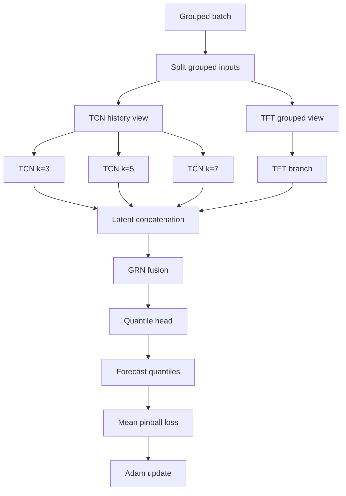

# Methodology

## 4.1 Method Framing And Research Positioning

Glucose prediction is formulated here as a probabilistic multi horizon sequence forecasting problem. Given a grouped history of glucose and related covariates, the model predicts the next `12` glucose values together with the quantiles `0.1`, `0.5`, and `0.9` at each future step. The methodology is a late fusion hybrid that combines Temporal Convolutional Network (TCN) branches, a Temporal Fusion Transformer (TFT) branch, a gated residual fusion block, and a final quantile head [1]-[6].

## 4.2 Rationale For Method Choice

The model combines two complementary forecasting families. TCNs offer causal convolutions, dilation, and efficient extraction of short and medium range patterns from encoder history [2]. TFT offers a structured way to combine static context, observed history, and known future covariates in a multi horizon setting [1]. Prior hybrid studies in other domains motivate using both families together rather than forcing one branch to explain the entire problem [3], [4].

Quantile regression is used because glucose forecasting is intrinsically uncertain. A point forecast alone would hide the range of plausible outcomes. Predicting multiple quantiles preserves lower, central, and upper summaries of the same future trajectory [5], [6].

## 4.3 Forecasting Pipeline

The end to end pipeline follows six steps. First, raw AZT1D files are standardized into a cleaned analysis table. Second, legal encoder and decoder windows are constructed without crossing temporal gaps. Third, each window is packed into grouped tensors with static, known, observed, and target history roles. Fourth, three TCN branches and one TFT branch process the sample in parallel. Fifth, the horizon aligned latent features are concatenated and fused through a gated residual network. Sixth, the final head emits per horizon quantile forecasts that are evaluated on held out data.

## 4.4 Model Architecture

The model used in this study is `FusedModel`, a late fusion hybrid composed of one TFT branch, three TCN branches, one post branch GRN, and one final quantile head.

### 4.4.1 Input Representation

The model receives grouped tensors rather than one flat feature matrix. Inputs are organized into static variables, known future variables, observed historical variables, and target history. This grouping matters because the TCN and TFT branches do not consume identical information budgets. The grouped batch contract preserves causal availability instead of collapsing every signal into one anonymous tensor.

The default sequence lengths are `L_e = 168` encoder steps and `L_d = 12` decoder steps on a `5` minute grid. Each sample therefore covers `14` hours of history and predicts the next `1` hour.

### 4.4.2 Temporal Convolutional Branch

The TCN side consumes only encoder side observed continuous variables together with target history. Three parallel branches use kernel sizes `3`, `5`, and `7`, which gives the model three receptive field biases over the same history. The shared branch configuration is:

| channels | dilations | dropout | normalization | prediction length |
|---|---|---|---|---|
| `(64, 64, 128)` | `(1, 2, 4)` | `0.1` | `layer_norm` | `12` |

Each branch is causal and emits horizon aligned latent features rather than final quantile predictions [2].

### 4.4.3 Temporal Fusion Transformer Branch

The TFT branch consumes grouped static features, encoder history, and decoder known future inputs [1]. Unlike the TCN path, it is explicitly designed to preserve semantic feature roles across the full encoder and decoder example axis. The branch hyperparameters are:

| hidden size | attention heads | dropout | attention dropout | layer norm epsilon | encoder length | total sequence length |
|---|---|---|---|---|---|---|
| `128` | `4` | `0.1` | `0.0` | `0.001` | `168` | `180` |

Categorical embedding sizes and several variable counts are bound at runtime from the prepared dataset rather than fixed in advance, so the model stays aligned with the realized feature schema of a given run.

### 4.4.4 Latent Fusion Mechanism

The decoder aligned TFT representation is concatenated with the three TCN branch representations along the feature axis. A GRN adapted from the TFT design then compresses the combined tensor back to the shared hidden width and acts as the nonlinear fusion block [1], [4]. Fusion therefore happens in latent space before the final prediction head rather than after separate branch forecasts have already been decoded.

### 4.4.5 Quantile Forecasting Head

The fused hidden state is passed to a position wise residual MLP head (`NNHead`) that emits one output channel per quantile at each horizon step. The head configuration is:

| input size | hidden size | feedforward size | residual blocks | dropout | quantiles |
|---|---|---|---|---|---|
| `128` | `128` | `256` | `2` | `0.1` | `(0.1, 0.5, 0.9)` |

The output tensor has shape \([B, L_d, |\mathcal{Q}|]\), where \(\mathcal{Q}\) is the configured quantile set.

## 4.5 Probabilistic Learning Objective

Training uses pinball loss over the forecast quantile tensor [5], [6]. For one target value \(y\), one predicted quantile \(\hat{y}_q\), and one quantile level \(q\), the loss is:

\[
\mathcal{L}_q(y, \hat{y}_q) =
\begin{cases}
q(y - \hat{y}_q), & y \ge \hat{y}_q \\
(1 - q)(\hat{y}_q - y), & y < \hat{y}_q
\end{cases}
\]

For the configured quantile set \(\mathcal{Q}\) and prediction horizon \(L_d\), the overall objective is the mean loss over batch items, horizon steps, and quantile channels:

\[
\mathcal{L} =
\frac{1}{|\mathcal{Q}|L_d}
\sum_{q \in \mathcal{Q}}
\sum_{\tau=1}^{L_d}
\mathcal{L}_q(y_{t+\tau}, \hat{y}_{t+\tau,q})
\]

At \(q = 0.5\), this objective corresponds to median estimation. The outer quantiles define lower and upper conditional cutoffs of the same future target.

## 4.6 Training Procedure

Each training step follows the same branch and fuse pattern. The grouped batch is split into the views required by the TCN and TFT branches, the branch features are fused, the fused state is projected into quantiles, and the output is supervised with pinball loss.

In concrete terms, encoder side tensors are routed into two branch specific views: a history only TCN input built from observed continuous variables and target history, and a semantically grouped TFT input built from static, historical, and known future covariates. Training is executed through PyTorch Lightning, which manages batching, backpropagation, validation scheduling, callback dispatch, and checkpoint management.

## 4.7 Hyperparameters And Experimental Configuration

The reported run configuration is taken from [`../../artifacts/main_run/run_summary.json`](../../artifacts/main_run/run_summary.json).

| sampling interval | encoder length | prediction length | window stride | split ratio | split mode | batch size | optimizer | learning rate | weight decay | max epochs | early stopping patience | quantiles |
|---|---|---|---|---|---|---|---|---|---|---|---|---|
| `5` minutes | `168` | `12` | `1` | `70 / 15 / 15` | within subject chronological | `128` | `Adam` | `0.001` | `0.0` | `1` | `5` validation checks | `(0.1, 0.5, 0.9)` |

The saved run used Apple Silicon MPS acceleration. Because `max_epochs` was `1`, the present report should be read as a baseline execution record rather than as the endpoint of an extended tuning process.

## 4.8 Reproducibility And Runtime Traceability

Reproducibility depends on separating declarative configuration from runtime bound metadata. The TFT branch, in particular, depends on categorical cardinalities and feature counts that are not fully known until the prepared dataset has been inspected. The run therefore binds those data dependent values before final model construction.

The default artifact directory is `artifacts/main_run/`. The saved run records configuration, metrics, predictions, grouped tables, checkpoints, telemetry, and report assets, which together provide a traceable description of the effective experiment.

## 4.9 Evaluation Protocol

The experimental protocol uses a `70 / 15 / 15` within subject chronological split. Each legal sample contains `168` historical steps and `12` future target steps on a `5` minute grid. Held out evaluation is performed on the full forecast quantile tensor rather than on scalar test loss alone. The reported metrics are MAE, RMSE, bias, overall pinball loss, mean interval width, and empirical interval coverage. Grouped summaries are also reported by horizon, subject, and glucose range.

## 4.10 Validation And Sanity Checks

Several safeguards are built into the pipeline. Causal TCN convolutions prevent future leakage through the convolution path, decoder inputs to TFT are limited to known future covariates, legal windows cannot cross temporal gaps, and runtime metadata binding keeps model dimensions aligned with the prepared data. These checks do not replace empirical validation, but they reduce common failure modes such as illegal windows, shape mismatch, and accidental leakage.

## 4.11 Methodological Scope And Constraints

The methodology should be read with several boundaries in mind. The reported configuration is a baseline experiment rather than a full tuning study. The evaluation answers a within subject forecasting question rather than unseen subject generalization. The use of `window_stride = 1` creates heavily overlapping samples, and the quantile set `(0.1, 0.5, 0.9)` is only a coarse view of forecast calibration. Finally, the architecture is motivated but not yet fully justified empirically because ablation against strong TCN only and TFT only baselines remains to be done.

These constraints frame how the method and its reported results should be interpreted.
